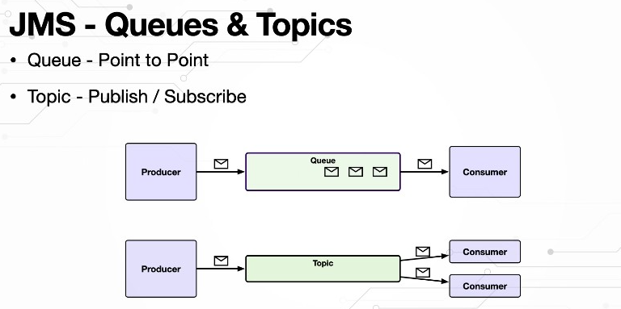
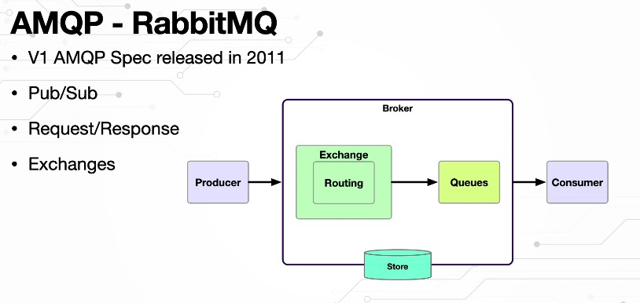
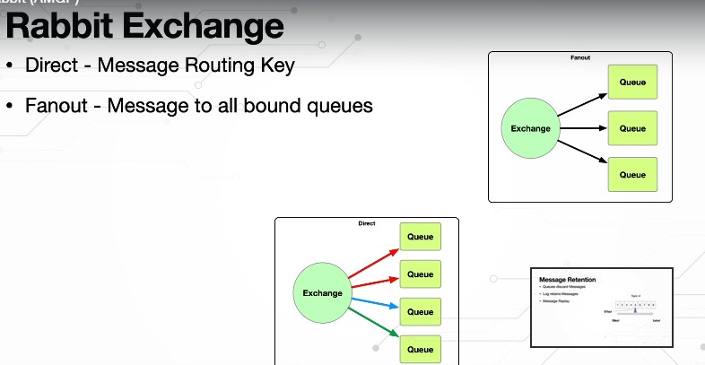
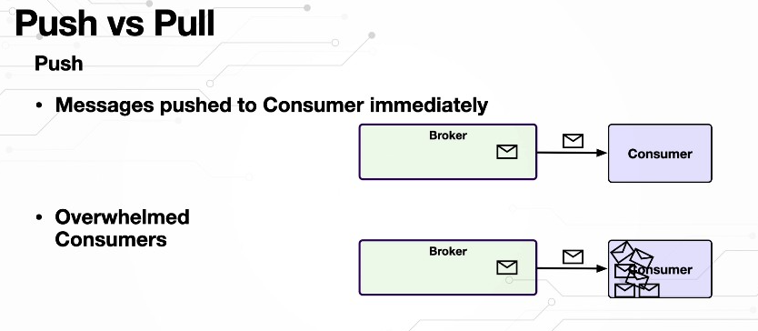
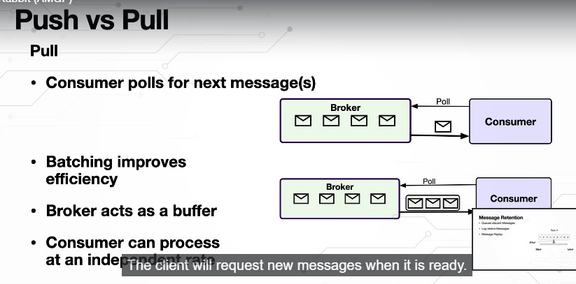

What is Kafka?

Kafka can have various definitions, depending on how we are using it, but one popular definition is

Kafka is a distributed commit log as events happen in a micro service application, these micro service

applications put these events onto a log apache

Kafka is a system for managing these logs.

The famous and popular term for these logs is a topic.

Kafka stores the events in a orderly fashion, and it also writes those to a disc not just one disc,

it can replicate them across disks to ensure that the messages or events are not lost.

Micro service applications exchange events through these topics or streams in real time.

And since the data and event can be processed as soon as they are produced, we can have Real-Time Analytics

and we can do recommendations or make decisions based on these analytics.

These Microservice applications will have their own processing logic, they dont

Just read the events from the topic and send them to another topic.

They will define their own computational logic.

That is where Kafka comes with the streaming API.The Microservice applications need to group data, aggregate

them, filter them, join them, etc..

Kafka gives us the streaming API, which is super simple to use and will be able to do all this right

out of the box in our Micro services is using the Kafka streaming API.

Last but not least, if there is data that is related to our applications in external databases or other

systems, we can use the Kafka connect, which can be easily configured.

We don't have to write any code.

There are hundreds of open source, uncommercial Kafka connecters that are readily available that can

integrate with other data sources or databases to fetch the data into Kafka, or to send the data from

Kafka to these external sources in a declarative manner with the simple configuration will be able to

use a connecter, connect to these data sources without writing any code.

In this lecture, you will learn why Kafka is so popular, that is the advantages of using Kafka.

The first Kafka supports multiple producers and consumers.

There is multiple producers can write to a single topic at the same time, and multiple consumers can

subscribe and consume messages from the very same topic.

Unlike traditional messaging systems, where once a message is consumed by a consumer from the topic,

it's gone.

But in Kafka, it retains the message, and another consumer application can still get the very same

message and process it in its own way.

Kafka also supports consumer groups and partitions that is within a application, a consumer application.

We can have parallel consumers running, which can be a part of a group called Consumer Group, and

the topic is divided into multiple partitions.

The messages from the producer will go across these partitions so that parallel processing is possible.

Kafka ensures that within a consumer group, the message will be consumed only once.

That is, only one consumer within the group will consume a particular message.

There will be no duplication.

So across applications, it allows the possibility of these applications processing the very same message.

But within a application, it allows parallelism by having a consumer group, and these consumers can

consume messages from various partitions which are nothing but divisions.

Within a topic.

You will learn partitions and consumer group in detail in lectures later on.

So this is where Kafka differs from traditional messaging systems and has all the advantages.

Secondly, it maintains a disk based persistence.

That is, even if a consumer is temporarily down because of a restart or a crash, when it comes back

up the kafka broker would have reatain the message in a disk storage with a preconfigurable amount of time

the consumer can get the message whenever it is ready.

Third, scalability as the Load on the kafka broker increases, these brokers can be easily scaled, for

our development environment, while learning Kafka we can use a just single broker.

But on our dev environment or testing environment, we can have 10 brokers.

And in a production environment, we can have a cluster of hundreds or thousands of brokers.

If one broker goes down, another broker will take over, giving us availability as well.

Last and most important performance because of all the aforementioned advantages, like multiple producers

and consumers having partitions and having parallel consumers consuming the messages and scalability,

we get a lot of performance gains by using Kafka.
The power and flexibility of Kafka allows us to use it to implement numerous use cases, starting with

messaging, Kafka can be used to exchange messages across micro service applications.

This could be one micro service application sending notifications to a Kafka topic to which other micro service

applications will subscribe and consume the notification to take the appropriate action.

Or we can also implement a simple producer consumer pattern where one micro service application is producing

a lot of work and other micro service applications.

Consume this work and get it done like order processing shipment, etc..

Activity tracking, this is how Kafka has originated at Linkedin, we can use it to track user activity

or any other activity, and we can feed it to a topic which can be read or are consumed by a machine

learning algorithm which can generate the recommendations for that user the producer application or the

website the user is browsing can read those recommendations and push them to the user whenever he does

a

Search Amazon, Netflix and various other websites does this as well.

Metrics and log aggregation as applications produce metrics on a regular basis or even logs, all those

can be aggregated and stored in a permanent storage for analysis.

This can be done right away as well.

Instead of waiting for a long time as the applications are producing metrics and logs, they can be

aggregated and put into systems like elastic search.

And we can right away analyze that data to see if there are any unwanted activities or security threats.

We can also use Kafka as a commit log, as database changes happen.

Those changes can be streamed on to a Kafka topic and we can use that data to replicate the database if

required, or simply to analyze what is going on with the database and see if there are any threats

or unwanted activity.

Last and very powerful stream processing, while all the aforementioned use cases can be treated as

streams, kafka streams open up doors for numerous use cases where we can create data pipelines as the

data flows through these pipelines and different stages.

Will have transformation, computational logic, the data will be transformed at each step and big data

tools like Hadoop, Storm, etc. can be a part of this data streaming pipelines as well.

So it is up to us how we want to use Kafka.

There are so many use cases, especially streaming opens up doors for using it to implement our own

custom use cases where we can have multiple streaming applications consuming from topics applying data

transformations which we create, and then putting them onto a another topic which will be fed to another

data streaming application and so on.

Where is or where can Kafka be used?

Kafka is the foundation for various big data platforms and even driven micro service applications,

cars, trucks and shipments can be tracked in real time using Kafka.

In factories kafka can be used to capture and analyze the Iot device data and make decisions on the fly.

Kafka can be used to process banking and stock exchange transactions in the financial world and in hospitals,

the patient information can be tracked and monitored and any changes in his condition can also be monitored

to treat him better.

In retail, hotel and travel, Kafka can be used to gather and react to customer interactions and based

on the customer interactions, recommendations can be shown to him.

Who use Kafka?

Maybe we should ask who doesn't use it because there are thousands of applications using Kafka around

the world, starting with Twitter, Twitter uses Kafka for its mobile app, Performance Management and

Analytics.

It has five billion sessions per day.

Uber uses Kafka to process more than a trillion events per day for thier log aggregation.

DB change log maintenance and several other events.

Streaming use cases they have even contributed a

UReplicator which is a cluster replication solution to the open source world.

Netflix uses a Kafka as their messaging backbone, with 4000 Kafka brokers in their cloud handling 700

billion events per day.

Yahoo uses Kafka for real time analytics, handling up to 20 GB data per second.

Pinterest users Kafka for its Real-Time advertising platform, with 2000 brokers handling eight billion

events per day.

These are only some of the popular applications.

Are clients using Kafka almost every application out there using Kafka in some way or the other.

In this lecture, you will learn about the four important components of Kafka architecture, namely

the Kafka, Broker, Zookeeper, producers and consumers.

The Kafka cluster is a collection of Kafka brokers, also referred to as Kafka Servers or Kafka Nodes

If you are coming from a messaging background, you already know what a broker is.

It is through the broker that the messages are exchanged between the producer and consumer applications.

The broker not only decouples the producer and consumer, but it also ensures that the messages are

persisted and are durable.

The Kafka Broker is a Java process, and we can increase the number of brokers to provide scalability

and durability of messages.

One of the brokers will be elected as a cluster leader or cluster controller.

All the other brokers will follow this leader.

It is the responsibility of the cluster leader or controller to manage the partitions.

Replicas and other administrative operations will be discussing this in detail in lectures later on.

Next is the zookeeper component, which is responsible for electing a cluster controller or leader,

all the broker nodes will register themselves with the zookeeper component when they come up and the

zookeeper will pick only one of the brokers as the cluster leader.

And if that broker goes down, it will pick up another broker as the cluster leader.

Zookeeper also maintains the state of the cluster like the metadata of the leader and followers.

The states, the quotas, the access control lists, everything will be maintained by zookeeper, although

Zookeeper is Apache opensource project of its own, when we install Kafka, it will come bundled with

Zookeeper, making it easy for us.

Kafka is also working on a component of its own that's going to replace Zookeeper in the near future.

Next is the producer component producer is an application that produces data that producers communicate

with the cluster using TCP protocol and they connect with the broadcast directly and start sending messages

to their topics.

A producer can send messages to multiple topics and a topic and receive messages from multiple producers

as well.

Last and the most important is the consumer.

It is an application that consumes from one or more topics, consumes records or data from one or more

topics and processes

it. Consumers coordinate among themselves as a group to balance the load and also track each other's

progress so they do a lot more work when compared to the producer applications.

We are going to discuss a lot more about it in lectures later on.

The producer applications create and exchange data using a record in Kafka.

There are seven attributes to a record, starting with topic partition, offset timestamp key headers

and finally the value.

The topic is the topic to which this record should be returned to the partition is a zero based index

to which the record should be written.

A record is always associated with only one partition, and the partition number can be set by the producer

application.

And if it is not set, it will be calculated based on the key that is provided in the record.

A hash value will be calculated by using the key value and the result will be used as the partition

number to which that record should go to.

Next is the offset, which is a 64 bit signed integer for locating the record within a partition.

The time stamp can be set by the producer application, and if it is not set, then the producer API

internally assigns the current time as the time stamp.

Next is the key, although it is called a key, it is an optional non-unique value, it is a array

of bytes.

A key value you present will be used to calculate the partition number.

A hash algorithm will be used along with this.

The value of the key and the partition number will be calculated to which the record should go to.

If the key value is not set because it is optional, then the Kafka will decide the partition number

in a Round-Robin fashion.

That is, it will assign the record to a particular partition based on the Round-Robin fashion.

And that might change in the future.

How Kafka wants to do it.

It is important to understand that although this attribute is called key, it is not the primary key

of our record.

We can even set the same key for multiple records on the producer, and all those records will end up

in the same partition.

So we can control that using the value of the key.

It is not unique.

If you want to uniquely identify a record, then you can use the partition number and the offset as

a composite primary key.

Using these two, you can uniquely identify a record.

Next is the headers, which is optional key value pairs, just like the Http headers to pass in metadata.

Last and very important is the value.

This is where the payload for our message lies.

It is a array of bytes.

It is the one that contains our business data, although the value is also optional.

Without it, the record doesn't make any sense.

So all the other attributes are like metadata for this data we are exchanging using the value attribute

as an assignment, I want you to launch your Web browser, search for Kafka, producer record Kafka,

producer record, go to the Kafka API page, Click on this, that will take you to the Kafka API.

And I want you to read this documentation of topic. It summarizes whatever I have just told you about the record.

You are going to use this producer record in lectures later on when you create a producer.

For now, just read this documentation up top and you will see that the constructor's.

That are used to create a producer record accept all these attributes which I have just talked about,

but the mandatory ones are the topic and the value.

The last constructor which takes the topic and value is the very minimum.

Otherwise, there are constructors that can take key value, partition, offset timestamp, etc..

In this lecture, we will learn about topics, partitions and offsets, messages in Kafka are returned

to a topic, and each topic can be divided into one or more partitions.

If Kafka is a distributed messaging or commit log, then a partition is a single log of messages or

Records. messages are appended to the end of a partition as they come in.

Kafka assigns each partition a unique number and also each message or a record that is stored within a

partition gets the offset value.

This offset values like array index.

It starts from zero for every partition.

And as the messages are stored, it will be incremented the partition number and the offset value uniquely

identify a record and also Kafka stores the partition number and offset value inside the record or

message.

Since messages can go across partitions, the messaging order across partitions is not guaranteed,

whereas the messaging order within a partition is maintained, the producer application can specify

which partition the message should go into using the partition number.

When a producer creates a record using the partition number attribute, it can tell which exact partition

it should go into.

Kafka will take that partition number and put the message into that partition.

If not, it can give you a key.

Kafka will use this key to calculate a hash and whatever the hash is that will become the partition

number into which that record will go into.

Even if the key is not provided by the producer, then Kafka will put the message into one of the partitions.

Using a Round-Robin algorithm.

Partitions give Kafka the power of scalability and availability.

That is, these partitions can be scaled across brokers' as the load increases, as there are too many

messages coming in.

Instead of putting all the partitions in one Broker, we can scale them across Brokers' here

I have four partitions on three brockers.

This will increase the performance and the application can be easily scaled.

Along with this

Partitions also support replication or duplication, which give high availability, as you can see

here, the partitions zero and one are present in Broker Zero as well as broker one.

The Partition two is present in broker one and also broker two.

And Partition three is duplicated both in broker two and broker zero.

This gives high availability.

Even if one broker goes down, another broker can take over.

That doesn't mean that all the brokers are processing the messages from each of these partitions.

It uses the concept of leader and follower here.

Each partition will have a leader and a follower.

In case of Broker zero, partition zero and one, have leader as broker zero.

In case of partition two the leader is broker one in case of partition three, the leader is broker two

for partition

three Broker zero is a Follower for partition, zero and one broker

One is a follower for partition two broker

Two is a follower.

Only if the other broker, which is the leader, goes down, these brokers will become the leader for

that partition as well.

It's like a backup.

We have a replica and if something goes wrong, the other broker can take over that work.

We can specify the

Duplication are the replicas we want using the replication factor, if the replication factor is one,

there will be no duplication.

The partition will be present on only one

Broker If the replication factor is two, then you will see something like what you see in these brokers.

The partitions will be duplicated, one copy will be created and they'll be stored across Brokers'.

The replication factory is three.

Then there will be two copies.

Total of three copies of a partition will exist across brokers'.

So when we create a topic we can specify the replication factor and also we can configure the replication

factor at a cluster level as well.

Partitions bring concurrency to Kafka, that is by having messages that belong to the topic spread across

partitions, we can create a consumer group.

A consumer group is a set of consumers working together to consume a topic.

A consumer group ensures that each partition is consumed by only one consumer.

Here we have four partitions and three consumers.

The first two consumers are consuming the first two partitions respectively, and the last consumer

is consuming the last two partitions.

Assigning a consumer to a partition is called the ownership of the partition by the consumer.

Consumers can easily be horizontally scaled.

That is, if the load on a consumer is increasing, we can scale up the consumers and the new consumer

will take over a partition.

Also, if one consumer feels the remaining consumers can coordinate among themselves and take over the

partitions that the failed consumer was working with.

This is a brief introduction to consumer group.

We will learn many more details in sections later on when you work with consumers.

In this lecture, I will introduce you to the concept of message batching Kafka producers won't send

one message at a time to the Kafka Broker instead they Batch them based on the topic and partition

to which they have to go to a batch, is a collection of messages that should be returned to that same

topic and partition.

This will reduce the network round trips, which otherwise are required to send each message to the kafka

brokers the larger the batch size, the more messages that will be processed in a given timeframe.

Batches are also typically compressed, providing more efficient data transfer and storage.

It will take some processing time.

Of course, it will take some processor to do this compression.

And also the messages are not sent as soon as they are produced.

So there will be some delay when we batch

So we have to make sure the batch size is not too big or too small.

We can configure the Batchsize in such a way to take advantage of message batching.

*A Kafka cluster is a combination of Brokers
*If a partion is not specified in the record which field in the record will be used to calculate a hash value Ans Key
*The division of a Kafka Topic is called a Partion
*The number of replicas of partitions can be controller using Replication Factor
*A consumer group ensures that a partition is consumed by only one consumer True
*Kafka producers batch messages based on Topic and partition

###Kafka Command CLI
kafka-topics --list --bootstrap-server localhost:9092

kafka-topics --create --bootstrap-server localhost:9092 --replication-factor 1 --partitions 1 --topic first-topic

kafka-topics --describe --bootstrap-server localhost:9092 --topic first-topic

kafka-console-consumer --bootstrap-server localhost:9092 --topic first-topic

kafka-console-producer --broker-list localhost:9092 --topic first-topic

kafka-topics --delete --bootstrap-server localhost:9092 --topic first-topic

Note:

For delete add the following in kafka server.properties

delete.topic.enable=true

To Start the kafka in windows the bin/windows in environment 
Step 1 :- open cmd and start the zookeeper using zookeeper-server start <configfolder path>\zookeeper.properties
.\bin\windows\zookeeper-server-start.bat .\config\zookeeper.properties
Step 2 :- open cmd and start the kaka using kafka-server start <configfolder path>\server.properties
.\bin\windows\kafka-server-start.bat .\config\server.properties
In addition to the command line tools for managing and administering the Kafka cluster, Kafka gives

Five core APIs application programming interfaces officially in Java and Scala.

But other programming languages like Python are building their own support for these APIs as well.

The first of these is the admin API, which allows us to manage and inspect the topics brokers and other

objects in the Kafka cluster.

GUI based tools are Web applications like Kafka drop make use of this admin API and they give us a browser

based access to the Kafka cluster.

Once we have Kafka drop running, we'll be able to manage our topics, brokers, etc, from our Web

browser through the Kafka drop and Kafka Drop internally uses the admin API to do its job.

Next is the producer and consumer API, which we use in our applications, the producer API is to publish

a stream of event records or messages to one or more Kafka topics.

The Consumer API is to subscribe and read those stream of messages from the Kafka broker.

Unlike traditional messaging systems, the producer and consumer APIs in kafka does a lot more.

On the producer side.

They automatically take it off serialisation, partition assignment and more, and on the consumer side,

they take care of deserialisation rebalancing and much more.

The streaming API allows us to implement stream processing applications, it allows to process event

streams and apply transformations, maintain state and much more.

We read from one topic, apply some transformations and write to another topic, a continuous stream

of data flow.

Last but not the least, the kafka connect API is to build and run reusable data, import and export connectors.

They allow us to import and export data from other systems so that they can integrate with Kafka.

Kafka provides a handful of ready to use connectors that can connect to various data sources.

It can be MySQL, Postgres, ElasticSearch, Kafka community provides us with ready to use characters

that can integrate with these data sources, fetch data to Kafka or push data from Kafka into these

data sources.

This lecture, I will walk you through the Kafka producer workflow in traditional messaging systems,

the producer API sends a message to the broker, gets a response back, and it is done.

But a Kafka producer does a lot more behind the scenes to start sending messages.

We create a producer record on which we can set various attributes, mainly the topic and the value,

which is the payload.

Optionally, we can set the partition timestamp key and headers once we have a producer record, will invoke

the send method on the producer.

At this point, the producer will hand over the producer record to serializer.

The serializer will look for the key and value in the record and it will convert them from our Java types

into byte arrays.

Kafka has several inbuilt serializes that can work with common types in Java.

you will also learn how to write our own custom serializers to convert object types into byte arrays and

later on you will use Avro, which does it for us out of the box as well.

Once the serializer converts the key and value into Bite array the record will be handed over to the

partitioner

The partitioner checks if the record has a partition number.

If the partition number is that it will use that as the partition that the record should go into.

If not, it will use the value of the key and a hashing algorithm to calculate the partition number.

Even if the key is not present, then a partition number will be assigned in a Round-Robin fashion.

At this point, the producer knows the which partition the record should go to.

It will add the records to the batch that should go to a particular topic and partition.

And a separate thread will pick up these batches and send them to that Kafka broker and the broker receives

the message and successfully writes it to Kafka.

We get a record metadata back if the right was successful and if the broker fails for some reason,

we get that failure back.

At this point, the producer can retry multiple times to send the message again to that topic and

partition.

If it keeps failing after some time, it will give up and throw the exception.

So all this happens within the producer, the serialization of the key and value, then the partitioner

taking care of which partition the record should go into putting those into batches.

And then a separate thread within the producer API will pick up that batch and send it to the Kafka

broker , which simply takes the message, writes it to the appropriate partition within a topic.

It was a fire and forget because we didn't wait for the response to come back, the send method returns

back a future record, metadata, hit control one assign statement to a new local variable.

And it returns you a future on which you can wait for the response.

And it is of time record metadata whenever the response is ready.

Once the message is placed on the topic, you get the metadata of that record do a control Z

Invoke dot get on the future hit control one, assign statement by a local variable will get a record

metadata.

Now, this is a synchronous call.

It is not a fire.

And forget, we are waiting for the record metadata.

Whenever it is ready do a sysout record metadata, dot partition, will tell us the partition where the message

went to similarly

Sysout record metadata, dot offset, will give us the offset as well.

Right click run java application and you will see those two values being printed on the console.

Now we have just one message being sent, but if there are thousands or millions of messages.

There will be some delay when we get that record metadata back.

So this is a synchronous call.

We are waiting for the response.
In this lecture, I will walk you through the Kafka Consumer API to create a consumer will create an

instance of the Kafka consumer class pass it the properties, just like the producer, we have the bootstrap

servers, which is a list of Kafka brokers, the key deserializer.

In this case, we have a de serializer in the producers.

We have a serializer here.

We have a deserializer.

It is a class from the Kafka library which implements that deserializer interface from Kafka.

We have string de serializer , integer deserializer and so on, and we can create our own deserializers

by implementing the deserializers interface from Kafka.

Next is the value deserializer property.

And finally, the consumer needs one more additional property, which the producer doesn't have, which

is the group Id.

Every consumer can belong to a particular group and it will consume the same set of messages.

Once we have a consumer created, it needs to subscribe to a topic to do that, we invoke the subscribe

method, which can take either a collection of topics or we can even use regular expressions to match

multiple topics.

The consumer can subscribe to multiple topics.

One, subscribe to invoke the poll method.

This is when the consumer will start polling the topic for messages and we provide a timeout once it

polls, it will wait for whatever timeout we have given.

And if there are no records, it will return empty records.

If there are records within that given time, it will return a collection of all those records which

we can loop through, get the key and value.

This poll method does a lot of things behind the scenes.

It simplifies a lot of things for us.

It does the partition rebalancing.

It checks the heartbeat's, it does the data fetching and a lot more.

In this lecture, we will create a Kafka consumer to do that, go to the consumer projects, source main

Java package, right.

click create a new class, call it, order consumer with the main method, finish double click to maximize

hit control D to delete that.

The first few lines will be similar to the other producers, so you can grab the properties from the

order producer, come back, paste them.

The first one is boot straps, servers, which remains the same, the second is the key dot de serializer

in case of consumer it will be de serializer unvalue or dot de serializer is the property name.

And the value for this property will also change.

It is not string serializer here.

It will be string de serializer .

Des

Same for integer Deserializer.

This will be Deserializer.

Make sure you get the casing right.

D is capital, everything else is small.

Copy that property.

We have one additional property we need to provide on the consumer, that is the consumers group ID ,

get rid of that key group, DOT ID

This can be any value that we want to provide, we'll call it, order group order group is the group.

This consumer belongs to create a new Kafka consumer by passing in the properties, props hit control

one, assign that to a local variable call this consumer.

And the key type is string value type is integer.

Once we have a consumer, we need to subscribe consumer dot, subscribe, consumer dot, subscribe is the method

you can pass this a pattern like a regular expression pattern where you can subscribe to multiple topics

using a wild card pattern, or you can pass in a collection of strings, which are the topic names.

I'm going to pass it to collection of strings collections.

Dot Singleton list will give me a list.

I pass in that order topic is what we have.

Once the subscription is done, the consumer needs to poll to the topic, the poll method can take milliseconds.

This is deprecated, so we no longer use this long milliseconds.

We use this method which takes the duration object, duration dot if you say zero.

The consumer will poll to see if the topic how any messages, if it doesn't, it will immediately return

back, it will not wait.

Instead of that, if you pass in milliseconds, there is method that takes milliseconds of Millies .

You can pass in a thousand milliseconds like that.

Or if you if you want to use seconds, it is of seconds.

I want to wait 20 seconds.

Will change this in the next lecture for now.

Will Poll, if there are no messages, we'll wait for 20 seconds within that 20 seconds.

If there are messages then this Poll method will return us.

Records assign this to a local variable to see what it returns.

Call it records or we can call this orders because we know that the records are nothing but orders.

So this returns back to consumer records object.

It is a collection.

use a for each loop.

And loop through these consumer records or orders to get the consumer record, each time we loop,

we get a consumer record object.

This is of type string and integer hit control.

Well, on this import, the consumer record.

And within this loop, we get that data sys out first is the product name the key that is being passed

in plus here instead of consumer record, you can call this order order.

Dot Key will give us the product name.

You can copy that line.

Paste it order dot value will give us the quantity.

Of that product being ordered.

And at the end of it, you can close the consumer right here after the far loop , consumer dot close,

will close the connection.

Right, click run the program as java application.

If all is well, it should have started, there we go, you can see it running, there is a stop button

here.

It will poll for 20 seconds.

It will poll and wait for 20 seconds to go run the producer now.

Order producer run that guy.

And you see that happening on the producer side, on the consumer side order consumer side.

You see that data being received as a product name is MacBook Pro and quantities 10.

If it is still polling, you can run the producer one more time.

The producer has run successfully, if the 20 seconds have not elapsed, then we will see it.

If not, the consumer is down so you can run it again.

But the key here is you have learned how to write a consumer by creating the properties, then the Kafka consumer

object.

You let it know which topic the consumer should subscribe to using the subscribe method.

Then you poll that topic by passing time duration.

If you pass it zero, the poll method will immediately return if there are no records there .

And then once we get these customer records, we loop through it, get each record out and get our data

out of it.

Kafka producer does not creates the partitions
Which of the following is not a part of a Kafka Producer API
Put the record in a partion and return metadata
The Kafka Broker expects the key and value in the record to be of Byte array type
A synchronous send method call returns Future<RecordMetadata>

The serialize method in a Serializer class returns byte [] array
We cannot use the inbuilt ready to use Kafka api classes to serialize and deserialize object types

##Apache AVRO
In the previous section, you have learned how to create custom serializer and deserializers to serialize

and deserialize object type data in Kafka, in this section, you are going to learn about Apache Avro,

which is a supercool framework that can do it right out of the box.

Once we start using Avro, we don't have to create this custom serializers and deserializers

Apache Avro is the open source project from Apache, which gives us a language neutral syntax.

So we are going to create schema file that represents our language object, whether it is order consumer

logs, etc. and on the producer side will use the Kafka Avro serializer from Avro right out of the box.

This serializer knows how to serialize the objects.

The language objects into a byte objects by looking at this schema file.

Once the object is converted into Byte array, we hand it over to the Kafka broker .

Similarly, on the consumer side, we have the Kafka Avro deserializer that can look at the schema file,

which we create, and then it will convert the byte, array back in to a language object.

How do the producer and consumer exchange this schema file we do it through a schema registry?

So on the producer side we configure a schema registry URL , which will be learning in the next few

lectures, and the Kafka Avro serializers are intelligent enough to automatically push the schema

to this schema registry and the Kafka Avro.

deserializers will look at the consumer configuration where we give the schema registry URL pull that

schema and do the deserialization for us.

This schema file is usually a Json file.

This can be a Json string object or an array typically it'll be a Json object where we can define

the record, the namespace and various fields and the field types, just like our Java types, can be

null if it doesn't carry any data int for integer long float double.

We have bytes and finally the string type, which is character sequences.

So the schema will typically look like this.

Here is a sample schema, which you will be creating in the next lecture.

It's a simple Jason file namespace is the first part which uniquely identifies the schema, which uniquely

gives it a namespace, its like package.

In Java, the type is record by default.

The name you use is the name of this record.

The fields are just like the fields we define in the class.

We give it a name and then that type, the customer name is of type string, product of type string.

Quantity is int the beauty of Avro.

We can generate a Java class out of this schema.

If you have worked with Java Web services, where you create wisdol file and then generate the stubs out

of it.

We are going to do something like that.

In the next few lectures.

We create the schema file and then we can create or generate a Java object using the Avro Maven plugin

and we can serialize and deserialize that object using out-of-the-box Kafka Avro serializers and Kafka Avro

deserializers.

As we use Avro, each record that is produced will comply to our Avro schema, these schemas will evolve

and change over time.

As for the business needs and when that happens, the downstream consumer applications and the deserializers

need to know about the latest schema files.

That is where the schema registry servers come in as different consumers might need different versions

of these schemas.

The schema registry server should maintain their different versions of a particular schema as well.

Confluent provides an open source implementation of the schema registry, which we are going to use.

In this lecture, I will walk you through the magic that happens behind the scenes once you start using

this Schema registry and the Avro Serializers and deserializers .

Once you start using the Schema registry you will create producers where you will use Keema file Avro schema

file that will be creating and they will use Avro serializer class, that is where the magic begins.

The Avro serializer not only converts the data into bytes, it also ensures that the data is compliant

with the schema file you have created.

It doesn't stop there.

It will take this schema file for the very first time.

We are using it and it pushes it to the schema registry.

Using the information we provide.

We configure the schema registry URL in the producers, the Avro serializer users.

That information connects to the schema registry pushes the schema to the schema registry.

The schema registry will store this schema file.

It will version it and they use the term called subject.

A subject is just a scope within which schema evolves over time.

It doesn't stop there, the Avro serializer will take the unique ID that is assigned to this schema by the

schema registry and it will store it in the header section of the record that is going out.

It then puts the data as well into the record and then the data will be sent by the producer or the

record will be sent by the producer to the Kafka.

Brokers that is the magic on the producer side.

Then we move on to the consumer side where we use the Avro.

Deserializers this guy will look at the schema ID in the header section of the record.

It connects to the schema registry using the schema registry URL we provide on the consumer fetches

The schema validates the data that came in against this schema.

All that magic happens behind the scenes, thanks, the Avro serializers and deserializers ,

And as these schemas change over time, the new schemas, when they are pushed, the versions will be

maintained magically by the schema registry.

So always the latest schema version, the id of it will be included in the record that will be sent

to the consumers.

The deserializers will come in, validate the data as per the ID that came in.

I'll talk a little more about the schema, compatibility, etc. after the hands on lecture's.

With this knowledge, you can work on the Avro hands on section and then we'll come back, revisit the

compatibility and the schema versioning a little bit later on.

And in between you and me, a secret is that this schema registry stores, all these schemas behind

the scenes in Kafka.

It uses underscore schemas topic and it stores them internally that we don't touch the topic.

But just for your information.

Kafka is used by this schema registry to store the schemas.

--- Partionar
Already learned that the partitioner assigners in Kafka will look at their records, partition no is specified,

it will use them to assign the record to a partition, or if it is not provided , then they will look

at the key, use the key to calculate the hash and put them in that particular partition.

In this section, you're going to learn how to create your own custom partition and put a record into

whichever partition you return from your custom partitioner.

You will also learn some advanced configuration that you can used in your producer that will impact

the way your producers work and also how the KAFKA brokers reacts.

So far, we have been relying on the automatic creation of the topics, that is when the producer is

run or when a consumer is run, the Kafka broker will see if the topic the consumer is trying to consume

already exists.

If not, it will automatically created for us.

And when it does it, it will only create it with a single partition to see our custom partition in

action.

We need more partitions, so we're going to create a topic manually with multiple partitions.

Go to the command line, use Kafka hyphen topics, hyphen hyphen, create hyphen hyphen zookeeper.

Localhost colon

Twenty one, 81, hyphen hyphen replication, hyphen factor there is just one.

hyphen hyphen partitions with what we care about, I want 10 partitions hyphen hyphen the topic.

name , we have been using order topic, order, partitioned topic, long name, hit enter that will create

a order partitioned topic with multiple partitions.

If you want to make sure you can describe it, use Kafka hyphen topics hyphen hyphen, describe hyphen

hyphen zookeeper localhost colon 2181 space.

The topic name by using hyphen hyphen topic.

You can copy that, paste it enter and you will see a ton of partitions being created starting from zero

all the way to nine, since we have only one broker, the leader is zero and the replicas also zero.

The index always starts from zero and it goes all the way to the higher number.

Now we have a topic with multiple partitions.

Copy the topic.

Go to your STS go to the custom serializer package in the producer, open up the order producer.

Use that in place of order CS topic go to order consumer and our custom deserializers package.

Open up the order consumer paste it instead of order CS topic.

We are going to use these two classes in the next lecture.

When we create a custom partitioner and we'll use it in the producer.

6:18 / 6:20
Transcript
In this lecture, we will create a custom partitioner and use it in our Kafka producer to do that, go to

the producer project Custom Serializer package Right Click.

Create a new class call it VIP All Capital.

Very important person.

Partitioner

And let's put this in a package called Customs serializers Dot Partitioners click on

the add button, search for partitioners interface from Kafka.

Select that interface.

Click OK, finish double click.

To maximize this interface has three methods that can be implemented.

We often implement just the partition method where the partition logic goes, but we have the configured

method using which we can pass in any card in additional configuration information that will help out

partitioning and the closed method where we can close any resources that we open up during partition,

logic, hit control D to delete the two do we are going to implement just a partition method by default?

It is returning a zero partition for all the records are all the messages that come in.

So this method.

Receives the topic.

The object as key are the key as object, the key as bite array the value, as object value, as byte array

and also one last important parameter cluster, which will have the entire cluster details in it, the

partition details, the number of partitions, etc..

So let's start by using the cluster object and retrieve how many partitions we have.

There is a method on the cluster called available partitions for topic.

Given a topic, it will return all the partitions for the topic.

So we have the topic info here pass that name hit control one assign statement to a local variable called

this partitions.

So we get a list of partition info.

Let's implement the default logic for partitioning, this will look just like How the Kafka broker will

do the partitioning for us.

It uses a murmur to algorithm.

We can use the same algorithm.

Utils dot murmur 2 and this guy takes the key as bites.

We have that available right here key bytes

So let's use it.

Key bytes pass that often.

This is a modulus operator.

We are going to divide this using the number of partitions.

So these partitions dot size minus one because it starts from index zero.

So this is the default logic, a very simple logic.

Murmur 2 is a hashing algorithm.

You can search for it and you can read more about it.

This is coming from.

Org Apache Kafka Common utils package.

Now, let's implement our own custom logic if.

The key.

Here, let's convert that into a sting.

We know that the key is the customer name within Brackett's string key.

Let's put that whole thing into brackets again, up to the key.

Let me add an additional bracket, the dot equals if the key dot equals within double quotes, I'm going

to use my own first name.

You can use your first name for testing if it is equal to Bharat.

I want to go I want that data record to go into partition number five, let's say my lucky number.

Otherwise it will return this partition number based on the random hash that is calculated just to make

sure this murmur does not return any negative values.

I have seen implementations where we use math dot abs here around it.

Math . ABS calculate the hash on that and then divide it by the total number of partitions you

can implement.

Any logic you want to ask to return integer, which should be a partition number.

And this is the special condition we have here where we are hard coding this name.

This name can even be passed through this configuration.

It's time to configure this partition and use it in the order producer for that, we just need to add

an additional property so props dot set property.

The key is partitioner

Dot class, and the value is the class name, which is VIP partitioner dot class dot get name.

Let's go to the consumer and display one additional information along with the customer name, the product,

the quantity, etc., do a SYS out the record we get here while we loop through will how the partition info.

We have seen that earlier.

So let's display the partition info as well.

Let's add a label to it.

Right there within the double quotes plus.

Partition.

Colon space, save it that way, we'll know if our custom partitioner is working now let's stop all the

consumers that are running.

If you have them go to the consumer right.

Click run it as Java application that will start the infinite loop.

And it is waiting now or it is polling to the order producer.

Right.

Click run as right now.

If you see the customer name is Bharat.

In your case, if you have used your own first name in the VIP partitioner to ensure that you are using

that here for your testing will change that and test it as well.

Right.

Click run as.

Java application.

There we go, see that partition, the kafka broker has assigned this a partition of five, meaning our

custom partitioner.

He's working now.

Let's go back to the producer.

Change this name instead of Bharat

I'm going to use John save it run that producer again.

The consumer is still up, see that now we do this partition three, it's using the internal logic that

we have given, right.

It still uses the custom partitioner.

It uses this logic instead of partition 5

This logic is coming into picture.

And whatever it is returning in this case, it has returned the three.

So it uses three.  

In this and the next couple of lectures, you will learn a lot more about the producer configuration.

To do that, go to the very first producer we have created,Com Bharat Kafka order Producer Package.

Open up the order producer Double Click to maximize.

These are the mandatory properties every producer needs, instead of hard coding them like this,

we have started like this so that you will understand what those properties really are internally.

But instead of hard coding them like this, we can use a producer config class that Kafka API gives us producer

cornfig dot bootstrap for every property there is a constant defined here.

Bootstrap under score servers underscore config.

Every constant has an underscore config at the end of it.

For the key serializer, we use producer config dot type in key.

You see that key underscore serializer underscore class_ config.

By now you can guess what it is for the value serializer producer config dot value underscore serializer

underscore class underscore config.

So this producer config is from the Kafka clients producer package.

In the next couple of lectures you are going to learn a lot more properties that you can set on a producer

and how they will affect the producer and the Broker .
In this and the next lecture, you will learn a few more important properties that we can set on to

the producer configuration, props dot set property producer config, dot acknowledge acks underscore

config.

This acknowledgement property.

If you point the cursor, it is ACKS the string for this constant value.

For this constant is ACKS and the value can be as zero or a one or all, only three values that

are possible.

This configuration controls how many partitions should receive the message before the producer considers

it as a successful right or send.

If we configure it to zero, the producer will send the message and immediately consider that the message

is sent successfully.

It won't wait for the response from the Broker

If you configure it to one, that means the producer receives a successful response from the broker.

Only if the leader replica successfully receives a message which is safe now that the producer will

know that the message has been sent successfully.

When you configure it to zero, if the producer doesn't care, if the message fails, whether the leader

is down temporarily or for whatever reason, the message is lost.

The last one, which is even more safer, is all.

The producer receives acknowledgement from the broker only once all the replicas received the message.

This is the safest but has more latency as the producer has to wait for the message to be delivered

to all the replicas.

Next, we have Buffer memory, Props dot set property producer, config dot buffer underscore, memory

underscore.

Config, the value for this can be in bytes.

This is the buffer memory the producer will use to buffer the messages before they are sent to the

broker.

If the application is too fast in producing the messages and handing them over to our producer API,

then the producers might block.

If this memory is not big enough by default, it is 256 MB and you can configure any numeric value higher

than that are lower than that if you want to.

Next is the compression type prop start, set property producer config dot compression, underscore

type, underscore config.

By default, the messages that are sent are not compressed.

Only if you set this configuration and provided a value.

That is when the messages will be compressed.

The values that are possible are snappy.

Compression from Google gzip and also lz fuor So Snappy is from Google, it does a good job

in utilizing CPU.

It doesn't utilize CPU that much when it comes to the compression ratio itself.

gzip is better than snappy.

So if you want less CPU to be used, then go with snappy if you are okay with the CPU that is being

used.

But if you want to reduce the network bandwidth that is being used, then go with gzip because the

compression ratio is higher and will save a lot of network bandwidth.

Next is the retries, which is very important, props dot , set property producer Config dot retries

underscore conflict.

This is a No.

Which when configure, the producer, will retry if there is some error that can be recovered, for

example, if the leader has temporarily gone down, then the producer, if the message is not sent,

it will retry again by default.

The producer will wait for hundred milliseconds before each retry.

So if you specify a value of zero, it will never retry.

If you specify a value of one, it will retry only once and so on.

If I say two the producer will wait by default for hundred milliseconds before it retry the first time

and the second time.

And we can control that hundred milliseconds by setting another property prop dot, set property

producer config dot.

Retry, see that back off in milliseconds, retry underscore back off under milliseconds config, this

is where you can change that.

Configuration, if you want it to wait for five hundred milliseconds, then you can configure that out if

you want to it to wait for the producer to wait for a second.

Then you can configure a thousand milliseconds so that it will wait for one second between each route,

which is very high.

Let's change it to maybe four hundred milliseconds.

That's the retry and the retry back off in milliseconds, the producers won't retry if there is

unrecoverable exception, like the messages to big error and the producer API automatically takes care

of retry.

So it'll be redundant if we write the retry logic on our own.

We don't have to do that in the next lecture.

We'll explore a few more important properties.

That can send the message to the Broker.

That's important to understand, but setting it to a very small size can be a problem because our batches

now will be very small, decreasing the throughput.

So the batch might have only two or three messages depending on how big our messages are.

Remember, this number is in bite, so have a higher number always instead of a smaller number for batch

size.

Next, props, dot set, property producer, config dot Linger milliseconds.

This is a property that compliments the batch size.

Earlier, I said, when configuring the batch size, although you configure it to a higher value, the

producer thread will hand over the message in the batch through a center thread as soon as the center thread is free

is free and available to send a message to the broker.

But you can control that by using this Linger milliseconds config.

You configure millisecond value, for example.

Two hundred milliseconds, then the producer will wait for two hundred milliseconds before it hands

over the messages to the sender thread although it is available.

Or even if it is available, so that gives us a chance to fill in this batch with a few more messages,

increasing the throughput with this small latency so you can set this to a little higher number so that

the producer will wait before it hands over this batch to the center thread and will have more messages

going to the broker with a single shot.

But this should be a string value.

Not a integer

Put that in double quotes

And one last property is the timeout props dot set property, produce the config, dot request timeout

MS.

As the name itself says, this is that time in milliseconds for which the producer will wait for a response

from the broker and it will timeout if a response doesn't come with in these and it will retry again.

So these are all the important properties.

There are a few more properties.

You can always launch your browser search for Kafka producer configuration and that will take you to

the confluent website or Apache.

Either of those two are OK.

Let me take you to the confluent website.

There we go.

Each property here is described in detail as an assignment.

I want you to read this document to the full.

## Mesage delivery and transcations
So far, you have learnt different advanced configuration that you can use on a Kafka producer in the

next few lectures you will learn how to achieve message delivery idempodency , there is no duplicate

messages.

Kafka producer API, along with the Broker, supports three different message delivery semantics.

You will learn what those are.

By default, it is at least once.

But by the end of these lectures you will learn how to achieve adempodency

That is no duplication of messages.

We will understand the difference between these, how to configure them and the advantages and disadvantages.

You will also learn how easy it is to use transactions within your producer in four simple steps that

is sending all the messages are sending no messages at all, just like the JDBC transactions are going

to use the Kafka producer API to enable transactions in your

Producer.
Idempotency means no duplication of messages .

### Message Delhivery sematics 
The Kafka producer API, along with the Kafka broker support Three message delivery semantics, the

first is at least one delivery at most, once delivery.

And finally, we have only one delivery.

The only ones message delivery uses idem potency.

There is no duplication of messages.

Let's take a look at each one of these, the configuration that is required and also the advantages

and disadvantages in at least one delivery.

If the message is received by the broker once everybody is happy, that is, the producer sends a message,

the broker takes it, writes it to all the partitions.

If we have replications of partitions and once all the partitions, the leader, the followers receive

the message, the broker treats it as committed, at which point it sends an acknowledgement back to

the producer and everybody is happy.

The message is delivered at least once.

But the issue with at least once delivery happens, if the broker has written the message to all the

partitions that it has committed the message.

But when it is trying to send an acknowledgement to the producer, if the acknowledgement fails for

some reason, the producer API will automatically retry to send the very same message resulting in message

duplication.

So if you are OK, to have message, duplication and reprocessing of the same message in the use case you

are working with, then you can go with the default, which is at least once delivery.

Otherwise you can use it most once delivery here.

The message should be delivered at most once, not more than that.

We do that using the retries configuration on the producer side will use the retry configuration and

set it to zero.

That is, the producer will never retry.

It will send a message if the broker writes it to all the partitions, everybody is happy.

But if it doesn't write, we have a issue because the producer won't retry and the message is lost.

So in case of at most once delivery, since the producer doesn't retry, we have the issue of messages

getting lost.

If you are okay with messages getting lost, then you can go it at most once delivery by simply configuring.

The retries to zero.

The last and the most desired is exactly ones semantics.

This is where we enable.

Idem potency by using a producer configuration called an able item buttons, once we do that, once

we set it to true, the magic happens behind the scenes.

The producer send method will generate a unique sequence number for every message.

So it's unique within a given partition the broker will receive it and the broker also does some magic,

it will maintain the message sequence number and along with it, it will generate a unique producer, ID

for each producer instance, which will be used by the producer in the message every time it sends a

message.

So the broker ensures that if a particular producer with a unique producer, ID is sending the same

message again, because now it has a sequence number, per partition within a partition, there will

be multiple sequence numbers.

It will check that sequence number.

And if it has already received a message with that sequence number within a given partition from a given

producer with a unique ID, then it will reject that message.

So here we can have all the retries and all that.

And also at the same time, we are avoiding duplication thanks to this simple property enabled dot the

idem potency

Once we do that, a producer send method generates a unique sequence, number per partition within the partition

for each message, and the broker maintains or gives a unique producer ID and this combination makes

this very powerful.

So if you want to use idem potency, simply go to your producer and use a new property props dot set

property producer config.

Dot.

Idem potency .

That guy, right, that enable idem potency.

Set it to true by default, it is false.

We have to set it to true, that's all that we need to do.

All the magic will happen behind the scenes thanks to the send method on the producer and the Kafka Broker

with generates producer ID per producer.

So if multiple instances of the same producer send duplicate messages, then that doesn't work, that

idempotency will fail.

The broker works.

Within a producer, ID are a producer instance, it can ensure that no duplicate messaging happens.

But if we have multiple instances of producer running, they both will get unique producer id.

And if they both send the same message, then the producer, that broker will not know still the duplication

can happen.

### Transaction
A transaction on the Kafka producer is just like a database transaction where we commit all the records

within the transaction or we roll back all or nothing atomicity, we achieve it by using the

producer API, starting with init transactions method.

This method initializes everything that is required for a transaction.

Then you start a transaction using the producer dot begin transaction, you start sending messages and

whenever you commit a transaction, all these messages within the transaction boundary from begin to

commit transaction in between those two lines will be committed to all the partitions.

If something goes wrong with one of the records being committed, everything will be rolled back, they

will not be committed and the producer can retry.

And if there is any exception, that exception will be raised.

If something goes wrong when the commit happens and we handle it using abort transaction, you have to invoke

producer dot abort transaction so that if there are any pending records that the producer is trying

to send, it will stop sending them.

we will learn all these methods in detail when you code this in the next lecture.

In this lecture, you will learn how easy it is to use transactions in a kafka producer to do that,

go to the com.bharath.kafka.orderproducer package, copy the very first producer, Class paste it

on the same package, change the name to transactional order producer remove the two at the end hit

OK, open up the transactional order producer.

Delete all the unwanted properties here, leave the first three mandatory properties.

Take out the rest of them, the very first step to start using Transaction's is to assign a unique transactional

id, props dot, set property producer config dot transactional ID.

is the property and the value can be any unique value, let's call it order Hyphen, producer hyphen

one every instance.

Of the producer that is starting a transaction or that has transactional code should have a unique

id.

Otherwise we will see exceptions if you try to run two instances of the very same producer class and

if both instances use the same transaction lD, then you get a exception back.

That's not possible.

The second step is to initialize the transactions producer dot init transactions, once you create

the producer object, the kafka producers init transactions will do a lot of things for us behind the scenes.

Go to this documentation here.

Let me copy the documentation and paste it in a text editor so that you can see it better.

So this init method init transactions method should be invoked before you go ahead and start a transaction.

That is what this first part says.

If you try to start off a transaction without invoking this method, you will get a exception.

This method does two things the first thing it ensures any transactions initiated by previous instances

of the producer with the same transactional Id are completed.

So it checks and ensures that if there are any producer instances that are already committing the transaction

are already in the transaction, it will make sure that they are all completed.

If previous instance had failed with a transaction in progress, it will be aborted.

And if the last transaction has begin completion, but not at finished, this method waits for its completion.

Secondly, it gets a producer ID, the broker maintains a unique producer, Id, along with the

producer Id it will get the epoc time and these two will be internally used once we start a transaction

and starts sending messages.

This information, this producer id, and this epoc information will be sent along with every message.

This information will be sent to the broker and the broker will track this entire transaction and make

sure of the idempotency using this producer Id and epoc.

So behind the scenes, there is so much happening.

And one more note that this method will raise a timeout exception if the transaction state cannot

be initialized before the expiration of this property.

Max dot blog dot milliseconds.

So here you can set a property called producer config, dot, max, dot block, underscore milliseconds

config and pass in, say a thousand milliseconds, which is one second.

This property is not only used for this init transactions method.

Once you said this property your send method also will be affected.

Your send method cannot block for more than a thousand milliseconds.

Not only send your commit transaction abort transaction methods which you are going to use in a few seconds

will also be impacted by this time.

Max Block Ms config.

I'm going to comment this out for now.

Now we have initialized the transactions.

We haven't started a transaction yet to start the transaction.

Let's have multiple records.

Copy this line where we are creating a record paste it call this record two.

And change the key and value of this to iPhone.

Or let's say dell laptop, because these is for our start up 20 Dell laptops and go to the tryblock producer

dot send record to without a callback, I'll tell you why we don't need a call back when we are using

Transaction's in the next few lectures.

I'll explain why we don't need this so you can take out this call back from here or we'll take it out

in the next few lectures.

We haven't started a transaction yet, but we have multiple sends now and I want to wrap these two sends

within one transaction.

I want both of them to succeed or both of them should fail.

Producer Dot begin transaction and at the end producer dot commit transaction.

That is how we use it, just like the JDBC API if you have worked with it.

And if there is an exception, there will be a

If any exception happens, then we should invoke producer, dot abort transaction, so this method ensures

that if we still have any messages between the producer API, if there are any messages that are to be yet

be sent and when an exception happens, all that will be aborted and those messages will not be sent.

Lets read the documentation for Begin transaction point.

cursor is a very straightforward.

Let me copy that guy.

It simply starts a transaction.

Go back right there, paste it should be called, before the start of every new transaction, note

that prior to the first invocation of this method, you must invoke init transactions.

I already mentioned that before we call begin transaction, you should have already invoked in it transactions.

Once you invoke begin transaction, the producer, Id, etc, will be used and they should

be ready.

So the broker would have send back a unique producer id and the epoc and internally the producer API.

when you say begin transaction.

It will be sending that information for every send and the broker will keep track of the messages coming

in, the idempotency the transaction management

All that will be done point your cursor on the commit

Go through that documentation as well.

Real quick.

Copy paste it commits, the ongoing transaction, this method will flush any unset records before actually

committing the transaction.

So if the producer still has some more records that are being buffered or batched yet to be sent, this method will

ensure that those are sent and then the transaction will be committed further.

If any of the send calls, which were part of the transaction, hit irrecoverable errors, this method

will throw the last received exception, immediately, and the transaction will not be committed.

That is when we handle that exception and invoke the abort transaction to stop any future messages that

are being batched from being sent.

the abort does that for us

It will stop all the future messages that are being sent and none of the messages will be sent.

So you can read the rest of the documentation on your own.

It's just about the time out property which I have already mentioned.

The max block milliseconds.

It affects the way these methods work as well.

The commit transaction and the abort transaction cannot block beyond this millisecond time frame once you set

it.

So that is how you use transactions in four simple steps.

First, you assign a unique transaction id for the instance of your producer, then you invoke any transactions,

then begin commit

And if there are exceptions, you go with the fifth step, which is aborting the transaction.

In this lecture, i will leave you with a few important points about transactions, the same producer

instance cannot have multiple transactions open at the same time that it has to close or commit a transaction

before it starts

Another transaction, the commit transaction method, flushes, any unsent records before the commit happens

And if there are any errors that happened during the commit, it will throw a exception.

That is the reason we don't need to have this call back here so you can get rid of this call back while

working with Transaction's, because all we do in this call back is handling an exception.

If there is an exception in case of aSynchronos calls when you are using transaction's having a call

back doesn't make any sense because if there are exceptions, that exception will be thrown and we catch

it invoke the abort transaction method.

So when a failure happens, we invoke the abort transaction to reset everything.

And again, the producer can start from the beginning.

The producers in Kafka are threads that is we can invoke the send method from multiple threads,

but we have to make sure that we start the transaction before any of those threads starts and we commit

the transaction after all the threads finished.

So it is our responsibility to ensure that.

**Which of the following is the default message delivery semantic used by Kafka ans :- Atleast once delivery
*Which of the following method should be invoked before calling the beginTransaction ans :- intiTransaction
A producer instance can not open multiple transactions  at the same time

###ConsumerGroup
In this lecture, we'll revisit the concept of consumer groups and learn a few more details about them.

Let's say we are working on a hospital management suit of applications.

We have a patient check out application billing and housekeeping applications.

The patient check application publishes a record to a kafka broker every time a patient checks out and

the billing and housekeeping applications will read, those records processed them using their own business

logic and do whatever they are supposed to do.

If the patient check out application keeps publishing a lot of records, it will increase the load on

our consumer applications and they might crash at some point if they can't handle the load.

That is where consumer groups come in.

Consumer groups are a group of consumers that can read from the same topic, but different partitions

in the topic.

The power of Kafka comes from its scaling abilities.

A topic is broken down into multiple partitions.

And then we can have a consumer group with one or more consumers that can consume from the partitions

of that topic.

If a group has only one consumer and we have four partitions, then the single consumer is responsible

for consuming the records from all the partitions.

But we can easily scale our consumer group up.

As the load increases, we can bump up the consumer group and add one more consumer.

Now we have two consumers, so these two consumers will split the partitions among themselves, the

first consumer consumes from the first two partitions and the second consumer consumes from the third

and fourth.

Now, if they load even increases, then we can add one more.

Now we have three consumers, the first two take off, the first two partitions and the last one can

take care of the last two partition.

Similarly, we can have four consumers where each consumer is responsible for consuming one partition

if we have more consumers than the number of partitions we have, then those consumers might hang.

Ideal, they will not do anything.

So it is our responsibility to ensure that we create enough partitions to keep our consumers in the

group

busy consumer groups not only allow us to scale and take care of the load that is coming in from the

producers.

But using consumer groups, multiple applications can consume from the same topic.

And have their own copies of data.

So here we have two consumer groups, one for the billing application and one for the housekeeping application,

and they can consume all the data from the same topic.

They will get all the data.

It's not like the billing application will get some records and the housekeeping will get some records.

They will get a copy of all the records.

Each one of them will get their own copy and they can do load balancing through consumer group of their

own.

## Consumer Group  Rebalancing

In this lecture, we will define what consumer group rebalancing is, and in the next lecture you will

see how it works.

Let's say we have a topic that is divided into four partitions and a consumer group that has three consumers

consuming from these four partitions.

If a new consumer is added to this consumer group, the new consumer will start reading from the partitions

that were previously consumed by the other consumers in the group.

Secondly, if one of the consumer goes down, whether it has gracefully shut down or whether it has

crashed, the partitions it has left out will have to be taken care of by the other consumers in the

consumer group, moving partition ownership from one consumer to another

Consumer in the group is called consumer group rebalancing.

I repeat that whenever a consumer is added to the consumer group or a consumer leaves the consumer group

moving partition ownership's from one consumer to another consumer is called rebalancing.

Rebalancing is the key for high availability and scalability of Kafka.

At the same time, we don't desire it all the time because whenever a rebalance happens, all the consumers

in the consumer group will go silent.

The consumer group will not do anything when the rebalancing is happening.

We will learn how it works in the next lecture.

To understand the magic behind rebalancing, we need to understand how consumer groups work when a new

consumer group is created.

Kafka allocates one of the brokers as the consumer group coordinator.

When a new consumer joins the consumer group, it does so by sending a joint request to the group coordinator.

The group coordinator at this point will send all the partition details to this very first consumer and

makes it a consumer group leader.

When another consumer joins the group by sending in a joint request, the group coordinator will trigger

a rebalance.

While doing that, it will hand over the current partition details and also the consumer details to

the group leader who does the rebalancing.

It is not the group co-ordinator.

It is the group leader, which is another consumer who does the rebalancing thanks to the kafka consumer API.

All that logic is already in built.

The leader does the rebalancing.

It will reassign all the partitions to the list of consumers that are available in the group and hands

over that list to the group coordinator.

The group coordinator will then send the individual partition allocation to the other consumers.

Only the group co-ordinator and the leader will have the entire list of consumers and the partition

allocation and the other consumers in the group will get only their partition allocation information and

another consumer joins the group.

The same process will be repeated.

It sends a request to the group co-ordinator.

The group co-ordinator triggers the rebalance the leader

Does the rebalancing hands that information to the group coordinator, which will hand the partition

allocation to all the consumers.

Even when a consumer leaves the group either gracefully or whether it has crashed, the same rebalancing

will happen.

How does the group coordinator know about the consumer health

And the consumers are responsible for sending a heartbeat as long as they are sending a heartbeat.

The group co-ordinator considers them to be alive if they wont for a certain amount of time, which

we can configure.

It considers them as debt and it will trigger rebalance.

And consumers can also gracefully leave the group by sending in a leave request when they close

off.

That will send a leave request to the group co-ordinator and it triggers a rebalance.

That is how rebalancing works.

But we should always remember when the rebalance process happens, the consumer group does nothing because

the group leader is assigning reassigning all the partitions to all the available, newly available

consumers.

The consumers will sit idle, so we need to ensure that we minimise rebalancing and if possible, avoid

it, which you will learn in lectures later on.

It allows the consumer API to do it.

The consumers can commit the offsets they have already processed to a special topic called Underscore,

Underscore, Consumer Underscore offsets

This is a inbuilt topic that comes with Kafka, and when a consumer has processed the messages as it is set up to offset

six, it will commit that information to this topic.

At this point, if a rebalancing happens, the new consumer that is assigned to this position will look

at this special topic for the information about which offset the previous consumer has processed up

to which offset the previous consumer has processed, and it will start consuming from the next offset.

But we have two issues that we need to be aware of.

The first issue is duplicate processing.

Let's say we have a consumer that has processed a partition up to record six and it has committed this

information.

It won't stop that.

It will invoke the pole method and it will process the next set of records.

And it has reached offset nine.

So it has processed all the way to offset nine, but it has not committed it at this point.

If rebalancing is to triggered, the new consumer that comes in will know that the previous consumer

has committed up to offset six and it will start processing from offset seven all the way to the end

of the partition, resulting in duplicate processing.

That is one issue.

Secondly, missing processing completely.

It could happen if the consumer has overcommitted, it is overconfident, it has received an offset

from the pole method and it has committed all the way, let's say, to offset 10, but it has only processed

up to offset two.

And if a rebalance happens at this point, the new consumer that comes in thinks that the previous consumer

has processed all the way to Record ten or offset ten, and it will only process starting offset eleven.

This is the problem of

Overcommitting and we will miss some records here committed but not processed, these records here will

never be processed.

So we need to be aware of those issues.

And in the next few lectures, we will learn how to use Autocommit, which is already there when you start

consuming the messages, how to do manual comit using synchronous and asynchronous way and also how

to commit a specific offset.

So we are going to do all this and we will learn how to minimize these problems.

You have seen here.

## Auto  Commit
In this lecture, you will understand how the auto commit works and the issue with it, to do that,

go to the order consumer projects customer de serializes package, open up the order consumer.

By default, auto commits are enabled, if you want to disable it, you can set up property, props dot

set property.

Within the double quotes enable dot auto, dot commit, passin a value of false by default, this

is true.

If you set it to false, auto commits will be turned off.

We'll do that in lectures later on when we use Manual commits.

But now get rid of that property hit control d.

The default time interval within which the auto commit happens is every five seconds.

That doesn't mean that automatically the offset or the records will be committed every five seconds.

The Poll method is the one which drives it, when the Poll method is invoked for the very first time.

It will fetch a offset and it will also start at timer for the auto commit.

The records will be processed the next time the poll is invoked.

The poll will check if the default five seconds have elapsed.

Only if the five seconds have elapsed, it will commit the previous offset if the five seconds have

not elapsed.

Let's say it said that the three second point or four second point, it will fetch the next offset of records

and the consumer will process them.

And the next time the poll is invoked, if the timer has gone beyond the five second mark, let's say

it has gone to six, seven, eight seconds, it will commit both the previous offsets and the timer

will be set to zero again.

The timer will start from zero.

It will go all the way to five seconds.

That understanding is important, although the default value is five seconds.

It is the poll method which drives it for us.

And you can change that time.

## Sync Commit
When we use the auto to commit the poll method, will do the commit for the offsets based on a time

interval, but to gain more control on when the offsets are committed.

We can start by commenting out the auto commit configuration and by setting a property. props dot set

property within the double quotes auto dot commit dot offset to false.

I don't want the offsets to be committed automatically.

That is what this property tells Kafka.

Once we have that, we can use the consumer dot

commit methods where we want.

Typically, the poll method returns as an offset of records.

We process them.

The processing logic can vary from

System to system our application to application, it could be storing the process data to the database

or based on what our logic we have finish the processing once the processing is complete, the consumer

dot commit.

There are two methods, sync and async you can commit.

Let's use the sync method for now.

In the next lecture will explore the async method so Commit Sync will commit the entire current offset.

So we have to ensure that all the records are processed before we invoke the commit sync method.

The commit sync method is intelligent enough to do retries when it tries to commit.

If there are any exceptions, it will retry to commit again unless it is unrecoverable exception.

And coming to the rebalancing problem which we had, we still have the rebalancing problem here because

let's say we have thousand records that are returned in the offset when we invoke the Poll method and

400 or 500 records are processed.

And at that point, if the rebalancing happens, whichever consumer picks up this offset after the rebalancing,

it will still reprocess those records starting from the beginning of the offset all the way to whatever

were processed earlier.

Still, we have the duplication problem will solve it eventually or will minimize it eventually.

But now we have more control on committing the offset.

Here we are ensuring that we commit offset right away as soon as it is processed and not after a certain

time frame.

## Commit Async

The commit sync method blocks the consumer application until the broker responds back to that commit

request degrading the performance of our application.

That is where we can use Commit async instead.

Commit async, commit async will not block.

The current offset will be sent for a commit to the Broker and the next pole will happen.

The next offset will be retrieved and that will be processed while the commit is still in progress

for the previous offset asynchronously.

But with great power comes some challenges.

This Commit async method won't retry if a commit fails.

Fails for some reason, the commit sync used to retry, but the commit async won't retry.

There is a reason for it which you need to understand.

Let's say when the pole is invoked for the very first time, we have received a offset with records

from one to thousand.

And those records are successfully processed as per our business needs and the commit async method is invoked.

Since it is asynchronous, this batch will be sent for a commit and the pole will be invoked.

It won't block, so the pole will be invoked, which will give the next set of records the next offset,

which will also be processed successfully.

But if the previous commit has failed for some reason, let's say that Broker was temporarily down

or for some reason if the previous commit has failed.

In the meantime, the next offset was successfully processed, let's say from one thousand one to two

thousand, and it was committed using the commit

async now the Broker is up.

It has successfully committed these records.

If the commit async retries to commit this batch or this offset, and if it succeeds, the order will

now be jumbled.

Depending on when the commit async retries, this order can be jumbled up.

And if a rebalance happens at this point, whichever consumer comes back up, it will look at this last

entry and it will reprocess all the entries after that.

So it will end up in duplicate processing.

That is the reason retries are not supported in Commit async.

So you need to understand that flow or problem.

commit async also gives us a call back that we can invoke or listen to, so that callback is new off set,

commit call back new offset commit call back.

Let's implement Anonymous.

Implementation of it, it has on complete method whenever the commit finishes, this call back

will be invoked and we can take appropriate action if we want to do a retry here

you are welcome to do it, but you already know what the problem can be.

So this guy receives the offsets that were processed.

And if there is any exception, we get that exception information as well.

So you can check if exception

Is not equal to null.

That means there is exception that happened during the commit you can either log it or if you want to

reprocess, you can reprocess.

But in most cases, we simply log a commit

failed for offset.

Plus, the offsets we have received just log that, and also you can log the exception if you want

to.

If you don't want to use the time, seconds, you can five seconds.

You can set a property props dot set property auto dot commit dot interval dot ms in milliseconds.

pass in a string value for example

If you pass in five hundred that means half a second.

If you pass in seven thousand, that means it is seven seconds.

One other important point to remember, just like the poll method, the closed method also does a commit.

So we have to ensure that whatever records we have, they are all processed before the close is being

invoked.

The problem with auto commit comes with rebalancing.

Let's say we have a offset of thousand records and we are going with their default auto commit time of five seconds.

And let's say two seconds have elapsed and we have reached the four hundred record.

The consumer has consumed one, two, four hundred records at this point.

If a rebalance happens, whenever a rebalance happens, all the consumers will start consuming from

the latest offset and these one, two, 400 records

Since they are not committed, they will be consumed again and they will be processed again.

So duplicate processing will happen.

If you want to reduce that, we can reduce the value of the auto commit so we can configure a lower value

like five hundred milliseconds, two seconds, etc. But the problem is not completely gone.

##Sync Commit
When we use the auto to commit the poll method, will do the commit for the offsets based on a time

interval, but to gain more control on when the offsets are committed.

We can start by commenting out the auto commit configuration and by setting a property. props dot set

property within the double quotes auto dot commit dot offset to false.

I don't want the offsets to be committed automatically.

That is what this property tells Kafka.

Once we have that, we can use the consumer dot

commit methods where we want.

Typically, the poll method returns as an offset of records.

We process them.

The processing logic can vary from

System to system our application to application, it could be storing the process data to the database

or based on what our logic we have finish the processing once the processing is complete, the consumer

dot commit.

There are two methods, sync and async you can commit.

Let's use the sync method for now.

In the next lecture will explore the async method so Commit Sync will commit the entire current offset.

So we have to ensure that all the records are processed before we invoke the commit sync method.

The commit sync method is intelligent enough to do retries when it tries to commit.

If there are any exceptions, it will retry to commit again unless it is unrecoverable exception.

And coming to the rebalancing problem which we had, we still have the rebalancing problem here because

let's say we have thousand records that are returned in the offset when we invoke the Poll method and

400 or 500 records are processed.

And at that point, if the rebalancing happens, whichever consumer picks up this offset after the rebalancing,

it will still reprocess those records starting from the beginning of the offset all the way to whatever

were processed earlier.

Still, we have the duplication problem will solve it eventually or will minimize it eventually.

But now we have more control on committing the offset.

Here we are ensuring that we commit offset right away as soon as it is processed and not after a certain

time frame.

## Commit Custom Offset
The commit sync and async methods by default will commit the entire offset that was returned by the previous

poll method, one disadvantage of that is that we have to wait for all the records in the offset to

be processed and then we invoke the commit.

If a rebalance happens in between processing of those records, then the next consumer, which takes up

this partition, will start consuming the messages again from the beginning of the previous offset,

because we haven't committed it at all.

By doing a custom commit, by taking things into our own hands, we can avoid that by doing more frequent

commits.

It's super simple to do that.

Both the commit sync and async methods allow us to do that.

There are overloaded versions.

I'm going to use async one.

Cut this paste it inside the for loop.

I want the commit to happen for every 10 records that are processed.

We can change it and add whatever logic we want in our application.

Int count is equal to zero and inside the for loop, if count percentage ten double equals zero for

every ten records.

I want this call to happen.

The commit call to happen.

And when that happens, we have to provide a offset right here, the async method not only takes

a call back, it also takes an additional parameter.

If you hit control space, you can see the overloaded versions.

This is the guy which we are using right now with a call back.

We can use this guy, which takes a map off topic partition, the key in this map is a topic partition

and the value is offset and metadata, we tell it which topics which partition and to which offset up

to which offset we want to commit.

Let's use that.

We can easily create this map.

Let me get rid of that.

The second parameter we know is a callback.

The first parameter is a map.

So let's use collections, dot singleton map add a comma for the callback, which is the second parameter.

The key is a new topic, partition, object topic, partition, the topic, information, we can get

it from the record record

dot partition.

Sorry, record.

dot topic.

The second parameter to the topic, partition constructor is the partition record dot partition will

give us the partition information and the value is the offset which we want to commit new offset and

metadata if there is any metadata optionally we can pass in that metadata.

Right now we don't.

We only care about the offset information.

How do we get the offset, the current record being processed, dot offset plus one

Because when the next consumer takes up the partition, we want it to start from the next record.

That's the reason we always add a one that the current record is already processed plus one.

So that is how we can commit a specific offset if we want to.

And don't forget to increment count.

Otherwise, it will never start incrementing right here before the for loop ends.

We can do a count plus plus so that for every ten records, it will do a commit now and it will give the topic

partition information or it'll pass the topic and partition information and the offset which we want

to commit.

Let me take that to new line so that you can see it.

Here is the offset information up to whichever record we have processed, plus one we are committing

more frequently.

So even if a rebalance happens, the next consumer that comes up will pick from this point instead of

waiting for the entire offset to be committed.

## Create a Rebalance Listner
So far, you have learned how to use offset commits to minimize the risk when a rebalance happens

in this and the next lecture, you will learn how to use consumer rebalance listeners to take it a step

further.

The consumer rebalance Listner is a special class with method, and those methods will be invoked when

a rebalance happens, the super simple to use it.

This consumer dot subscribe method takes a topic.

And also there are overloaded versions that take a consumer rebalanced listener as a second parameter

to create a consumer rebalance listner

we are going to create inner class right here once the consumer is created before the subscriber

method is invoked, subscribe method is invoked.

Create a class call it

Re balance handler this guy should implement the consumer implements

The consumer rebalance listener interface hit control one, and this interface has two methods that

we need to provide implementation for control d to delete those, we are going to implement this first

method in the next lecture.

As the name itself says, the first method is on.

Partitions revoked.

So this method will be invoked whenever the rebalancing is triggered and before the partitions are being

revoked from this particular consumer.

So if there is any clean up left out on the consumer side and also if there are any records, the offsets of

which are not committed yet, this is a great place to commit those offsets.

This is our last chance before the consumer loses the partitions completely.

And then this method will be invoked when the partitions are being assigned.

So on partitions assigned, once the new partitions are assigned, if we want to take any action, this

is where you can do that.

And you will pass the instance of this to the subscribe method, that is how the consumer will know about

this rebalance listener.

So right here, whenever we are subscribing new rebalance and that's it, it's that simple to use a

rebalanced handler will implement some logic.

Where will be committing the left over records, or off sets right in this mathod will do that in the

next lecture

## Commit last offset processed

This lecture will commit any offsets that are processed but are yet to be committed in our rebalance

handler right here on the partitions revoke before the partitions are revoked.

You can use consumer dot commit either sync or async lets commit, sync which is simpler commits sync and

we need to pass it, the partitions, the offsets that we want to commit.

So we need access to the offset information here as the consumer is processing the records, we need

to keep track of which records are processed but are yet to be committed.

And to do that start by extracting this collection dot singleton map the very first parameter which

we pass to the commit async.

Hit control one, once you select it all the way to the end of that parameter, extract to a local variable,

call it current offsets, you will see what it is and why we are calling it current offsets.

Copy.

The left hand side of it all the way to the equal to copy it, go up top.

Before even the consumer is created this is the state we are going to maintain as the records are processed,

this map will have the latest partition and offset information.

So here you simply create a new hash map and as the records are processed, go down.

Instead of creating a new hash map, we will.

First, cut this out on the left side, we don't have to do the collections dot singleton map and

all that, get rid of all that we do a

current offsets dot put.

So this map will be continuously updated with the topic, partition information and offset metadata.

cut this line and put it outside this if.

So as the records are processed, we'll be storing that information in this map, so this map will always

have the latest offset that is processed.

Here this logic is fine.

If count percentage ten is zero, then we are committing even

If you don't have this logic, if you invoke the commit method outside this for loop, it will only commit once the

entire offset is processed.

But we are ensuring that as the processing is happening and before the commit happens, if a rebalance is triggered,

we still have the last record information that was processed.

Now we can use this current offset information right here in this commit sync.

So you simply take this current offset pass it to this commit sync method and when the rebalance is trigger.

This method will be invoked and we at least commit the last record that was processed, so we minimize

the risk that is there with rebalancing of not committing the record.

So that is how you can use a rebalanced listener by implementing the consumer rebalance listener interface

and using the on partition invoke method and committing the records.

## Using ConsumerConfig Class
In this and the next few lectures, we'll be learning a little more about the consumer configuration.

To do that, go to the very first consumer we have created, which is under the consumer project, com

Bharath Kafka order consumer, open up the class.

Right now, we have only the mandatory properties that are set first, let's get rid of these hard coded

values, just like the producer config.

On the producer side, we have a class called consumer config that has all the constants consumer config,

dot, bootstrap servers, config.

Similarly for the key deserializer, it's consumer config dot key deserializer class.

Next is the value deserializer consumer config dot value deserializer class.

Same for group ID consumer config dot group Id Config.

In the next few lectures you're going to learn a lot more important properties that we can configure

on the consumer and how they affect the consumer broker

And so on.

## Min fetch Size and Timeouts
In this lecture, you will learn four important properties that we can configure on the consumer props

dot set property, consumer config dot fetch underscore Min.

Underscore bytes, underscore config is the very first one, this property tells the Kafka broker to wait

until it has so much of data to be sent.

For example, if you configure it to one zero two four, it has to have those many number of bytes before

it can send the data to the consumer.

By default, it is one mb.

The higher the number, the better it is because the consumer and the broker don't have to go back and

forth to exchange the data.

And the consumer can keep working on this data.

Next, we have the fetch max weight in milliseconds set property, consumer config dot fetch

max weight in milliseconds by default.

This is five hundred milliseconds.

If you configure it to 200, Kafka broker will wait for two hundred milliseconds before it sends the data.

The way it works.

If we have both of these configured, kafka broker will check if this memory is reached already.

If it has so much load, it will automatically send all the messages.

Whichever comes first, the two hundred milliseconds come first, even before this memory is filled

in with the messages, then it will send all the messages to the consumer.

Next is the heartbeat interval in milliseconds, props dot set property, consumer config dot

heartbeat interval in milliseconds.

This is the value in milliseconds.

Say a thousand milliseconds.

For every thousand milliseconds, the consumer has to send a heartbeat to the coordinator, the consumer

group coordinator.

That is what this value is telling.

There is another value that is complemented by this set property, consumer config dot

Session time out and consumer conflict dot session timeout in milliseconds again, this is in milliseconds,

say three thousand milliseconds or three seconds.

This property tells the broker for how long the consumer can go without sending the heartbeat information.

So when you configure this heart beat Interval, we are seeing consumer go ahead and send the heartbeat

every thousand seconds.

But it might skip if the load is too much, for whatever reason, it went down and it came back, it

could not send the heartbeat.

That is OK.

But if it doesn't send the heartbeat for three seconds, then the consumer will consider this as dead

and coordinator the consumer group coordinator, will trigger a rebalance and a good practice and a

recommended practice is that the heartbeat interval usually should be one third of this session timeout

configuration.

## Four More properties of Consumer
In this lecture, you will learn four more consumer properties, props dot set property, consumer

conflict, dot max partition fetch bytes by default.

This is one mb in bytes

This value controls the maximum number of bytes the server returns to the consumer and the default is

one mb.

And if we go with the default and if we have 30 partitions and five consumers consuming from these partitions,

then each consumer gets six partitions.

So we have to ensure that each consumer has at least six MB space, but it is usually recommended that

we give it more space because if one of the consumer goes down, the other consumers need to handle

its partitions as well.

So the max partition fetch bytes controls how many bytes of data per partition.

The server returns the server or the broker returns to the consumer.

Next props dot set property

Consumer config dot auto offset reset.

auto offset reset is a value that controls the consumer behaviour if it starts reading a partition that

doesn't have a committed offset.

We have two values that we can pass here within the double quotes

Latest is the first one.

If we set this too latest is the consumer will start reading those records, which came to the partition.

After the consumer has started running the latest records, it will ignore the previous records which

were there before the consumer has started running.

The second value we can set is the earliest.

If we set it to this, the consumer will start reading from the beginning of the partition.

It will process all the records from the beginning of the partition next is the

The client ID consumer config dot client.

Client.

Id config this can be used both on consumers and producers, and it can be any unique string value

order consumer any unique string value, and it'll be used by the broker for logging metrics and quota

allocation purposes.

Next, props dot set property.

Consumer config dot max underscore poll underscore Records config.

This is the maximum number of records the Poll method can return, this controls the amount of data

our application will need to process in the polling loop.

So you can specify exactly the number of records each poll should return and the broker will return

those many number of records.

And our consumer will have to take care of those records in the polling loop every time the poll is called

These are the number of records that will be returned.

## Partion Assignor Strategy
In this lecture, we learn about another useful property, which is partition assignment strategy props

dot set property, consumer config, dot partition assignment strategy.

here we can configure a class when you have learned about the partition assignments and consumer groups,

you have learned that internally the Partition assigner is responsible for assigning partitions to consumers

in the group. There are two partition assigners range

assigner is the first one dot Class dot get name.

And the second one is the round robin assigner, so the default is the range assigner, and if you want

to configure round robin assigner, you are welcome to do that as well.

Let's see the differences when we use a range assigner

Let's say we have two topics with three partitions each and two consumers in the consumer group.

If the range assigner is used, which is the default, it will take the consecutive

subset of partitions from each topic and assigns them to the consumer.

That is a consumer.

One will get the two

consecutive partitions in topic one, first p zero and P one, and then it also gets the consecutive partitions

from topic two and then it starts assigning the second consumer the only left out.

Consecutive partitions p two from first topic and p two from second topic so it never equally divides them.

The first consumer ends up getting more partitions than the second consumer.

We can configure the Round-Robin assigner, in which case it will go in a round robin fashion.

It will club up or it will combine the partitions of both the topics and then it will start doing the

assignment.

consumer one will get P zero from topic one.

Then it will go to consumer two.

It will get the P one from topic one.

Then it goes back in a round robin fashion.

Consumer one will get P two from topic one.

consumer two will get P zero from topic two, goes back, consumer one will get P one from topic two.

And finally, consumer two get P two from topic to Round-Robin, you see that consumers most of the times

will get equal partitions

If not, there will be one extra partition for the first consumer.

So it's up to you.

You can decide which assigner to use by default.

It is the range Assigner.

QUES
Moving the partition ownership from one consumer to another is called Consumer Group Rebalancing
The group coordinator is the one that does rebalancing false
If a rebalance happens when some records are processed but not committed which of the following will happen : - Records Processed multiple times (Duplicates)
If a rebalance happens when records are committed but not yet processed which of the following will happen:- Records not being processed
Implementation Of consumer Rebalance listner will allow us take action when a rebalance is triggered
If both FETCH_MIN_BYTES_CONFIG and FETCH_MAX_WAIT_MS_CONFIG are configured whichever value is reached first will be used True
1/3 is the  recommended fractional value for HEARTBEAT_INTERVAL_MS_CONFIG compared to SESSION_TIMEOUT_MS_CONFIG
If we want the consumer to start reading from the beginning of the partition that does not have a committed offset , what is the value to be set to AUTO_OFFSET_RESET_CONFIG :- Earliest 

## Create A simple Consumer
So far, the consumers we have created are all a part of a consumer group, a particular consumer group

wherein the group coordinator will take care of the partition assignment, the partition reassignment,

if a rebalance happens the offset management and all that happens through the consumer group coordinator.

This is good enough for most of the kafka consumer applications, but kafka also allows you to create simple or

standalone consumers that need not be a part of our group, which is very rare.

But in this section, you're going to learn how to create this simple or standalone consumers which

don't belong to a consumer group.

So once you create these consumers, there is no concept of rebalancing, group, coordinator, etc.

Your consumer is responsible for taking care of certain partitions.

So you will have to assign partitions instead of the subscribe method which subscribe to a particular

topic.

You will be using the assign method on the consumer.

Once you create a Kafka consumer, you assign a set of partitions which should be consumed by that consumer.

There is no rebalancing and it's all up to you.

So to get all the partitions on a particular topic, you can invoke consumer dot partitions for method

This will give you all the partitions.

If you want to assign all the partitions belonging to a particular topic to a consumer, you can manually

assign only certain partitions, which I will show you in the next lecture.

You can hardcode the partitions you want this consumer to handle as well.

This is a very rare requirement, but if you have such a requirement where you simply want to create

a single consumer, you don't want it to belong to a group, you don't want to go through the rebalancing.

You will see how to do that in the next few lectures and when you create a simple consumer.

Once you invoke these partitions for method on the consumer, it will return you the current partitions

on the topic once the consumer is running.

If a new partition is created, that will not be available.

You will have to invoke this partition for method again, partitions for methods again.

So you might have to put this inside a loop and keep checking if there are new partitions and then and

reassign those partitions to the consumer.

## Create a Standalone Consumer
In this lecture, you will learn how to create a simple or standalone consumer to do that, go to the

Order Consumer Project, go to the the very first consumer class under a com bharath kafka order consumer copy it,

paste it on the same package.

Change it to simple consumer.

Simple consumer is the name open the simple consumer, let's move it into a package of its own instead

of order consumers sub package change it to simple consumer.

Hit control one move it to the package of its own double click to maximize we don't need a lot of information

or configuration here, starting from group.

Id take out all the properties.

We don't need the group id now because we are a simple consumer, not a part of any consumer group.

That is the first step.

Next, you create a consumer as usual, and instead of invoking consumer dot subscribe when we are working

with simple consumers.

We do consumer dot assign so hit control d to get rid of that line, invoke consumer dot assign.

This method takes a collection of partitions.

So new array list of partitions.

Select that guy, control one, assign that to a local variable.

Call it partitions, that's fine.

now to fill in this partition is you can do a partitions dot add new topic partition.

Pass in the topic, we are going to use a topic called Simple consumer topic later in the producer will

use this and this topic will be automatically created for us when we run the producer application,

the partition, you can hardcoded it if you know the numbers within a topic which you want to assign to

this simple consumer.

You can do it like this.

You can copy that line if you want to assign one more partition paste that line assign the partition number.

This is one way of doing it.

Or if you want to assign all the partitions on a given topic to this consumer, the easiest way is go

up top.

Invoke consumer dot partitions for method.

This method takes the topic which we have right here, which is a simple consumer topic, and it returns

all the partitions.

That topic has so control

One assigned statement to the new local variable call it Partition infos Partition infos.

So here we get the partition infos back, but here we need a top partition.

So we are going to look through this partition infos and then assign our fill in this partitions

array list.

So right after this array list, you can take out these hardcoded lines.

Start at for loop for partition info info colon

From this partition infos list copy that and paste it right there.

Start off the loop.

Let me get this spelling right here.

It's partition, partition info, each partition info

As we get it, we want to put an object into the partition list partitions, dot add new partition.

New topic, partition is what we want, a new topic, partition, the topic will always remain the same,

which is this guy here, simple consumer topic.

And we get the partition number from the Info info dot partition will give us the partition number.

So by the time this loop finishes, well, we would have assigned all the partitions of this topic.

To this list, and we are passing that list to the consumers assignment method, so the consumer will

be ready to consume messages from all the partitions of this particular topic, the rest of the logic

will remain the same.

How we process the records, the poll method works the same.

## Create a producer to test 

In this lecture, we'll create a simple producer and test the simple consumer to do that, go to the

order producer, go to the very first consumer, our producer we have created under com bharath Kafka

order producer.

Copy that order producer paste it on the same package, call it simple consumer test

Producer , simple consumer test producer.

Open up the new class.

Get rid of all the unwanted configuration, leave it with the three mandatory properties and the only

change that is required here is the topic name.

When we create a producer record, we need to grab the topic name from the consumer so that we use a

separate topic here.

That's it now we can run the producer first and then go run the consumer, or we can run the consumer

first, but for running the consumer, we already need to have a topic.

The consumer won't create a topic if it doesn't exist.

So let's run the producer, which will produce a message.

It has successfully produced a message now go to the consumer before you go ahead and do that, you

need to set one more property.

When we have a consumer group, everything will be taken care of, like the off sets and all that.

But when we are running a standalone consumer, we need to set a property.

I will explain why we need this consumer config dot offset reset.

So when this consumer runs, it doesn't know where it has to start from.

So here I'm going to tell it start from the earliest, otherwise it will start consuming only those

messages that come in after it starts.

So now it will go to the beginning of the topic and it will read all the messages right

Click Run Java application.

The consumer is up.

There we go.

You can see the messages being consumed so you can put this consumer in a while, loop, do whatever

you want.

But we have seen a simple consumer that is not a part of the consumer group which is working.

## Important points to rememer with simple consumer
In this lecture, I will leave you with a few important things you need to remember while working with

simple consumers.

The poll method gets a batch of records to process them and the auto commit will happen by default.

But if we want to take the offset commits into your hands while working with simple consumers, which

is very rare, we need to set another property.

Let's try to do it without setting the property.

If you say consumer, dot commit sync or async, either of those right after the records are processed,

I'm using

commit dot commit async right

Click run this as java application and you will see an exception.

Let me copy that exception to my text editor so that you can see it better.

It says invalid group ID to use the group management or offset commit APIs, you must provide a valid

group id in the consumer configuration.

So far the offset to use the offset commit APIs.

We should be a part of a Valid group, although we don't want the consumer group having multiple

consumers and all that, we still need to provide the group dot id at least as of August 21, 2021.

That is the way Kafka works.

It has to go through the group coordinator and all that internally.

So we need to set props dot set property, consumer config dot group id config, set it to a unique value,

call it simple consumer group.

So this group has only one consumer right click run Java application and now you will not see any exceptions

if you have data that will be processed, but at least you are not seeing any exceptions.

And if you add your consumer to an existing consumer group, which is already consuming the messages,

you will get a commit exception.

You can't add a simple consumer to a active group which has multiple consumers in it and already is

processing the messages.

But you can use the same consumer group for multiple simple consumers you will not have any exceptions.

All this comes from Kafka documentation, and that might be updated in the future.

But right now, as of August 2021, if you want to take commit into your own hands, which is very rare

when we work with simple consumers, we will have to provide the group id

If not, we will get the exception.

## Steam Processing
In this lecture, you will learn what real time stream processing is, in big data systems like Hadoop.

The data is first stored in to systems which we refer to as data leaks.

We then use tools that will pull this data, analyze the data and generate reports that can be used

to make business decisions.

We call this entire process as near Real-Time .

We don't call it real time, but we call it near real time because there is a slight time delay between

the data being generated, it being pulled, the analysis being made and the report being generated.

Data streaming, on the other hand, is a continuous flow of business events or data.

Unlike big data, we do not store the data to a data lake or a database.

It is data in motion.

The data stream doesn't have a predetermined beginning or ending.

As the data flows through the streaming applications or the stream processing applications.

These applications can apply computational logic like aggregations, transformations, etc. on this

data and the analytics, or the reports will be generated right away in real time.

And when I introduced you to Kafka in the first few sections, i have showed you were, Kafka can be used.

So data processing also applies to all these use cases.

The real time data processing or real time stream processing applies to all these use cases.

Micro service applications can use the Kafka realtime stream processing, along with other big data tools

like Strom Spark, etc. to analyse the data right away and generate the reports, we can use realtime

stream processing to monitor the trucks, cars, etc. to see that they are on time to their destination.

And if something goes wrong, we can suggest or fix it right away.

Factories can use real time stream processing to analyze the data that comes from Iot devices and make

intelligent decisions realtime stream processing and use it for payment transactions, stock transactions

and more in the financial domain in hospitals,

We can use it to monitor the health of a patient and take intelligent decisions and then in retail hotel

travel.

It can be used for recommendations and more.

There are several other use cases where real time stream processing can be used to make decisions in

real time.

And Kafka makes it super easy for us to create this computational logic as that data flows by giving

us a Kafka streams library, the streams library is divided into processor API

on top of the processor API, we have the streams, DSL domain, specific language streams

DSL is very simple to use and make all the transformations joins, etc. on the data as it flows through

our applications.

For most of the use cases, the streams DSL is good enough, but that is not enough, you can always go

down to the lower level and use the processor API as well.

* kafka-topics --create \
--bootstrap-server localhost:9092 \
--replication-factor 1 \
--partitions 1 \
--topic streams-dataflow-input

kafka-topics --create \
--bootstrap-server localhost:9092 \
--replication-factor 1 \
--partitions 1 \
--topic streams-dataflow-output

kafka-console-producer --bootstrap-server localhost:9092 --topic streams-dataflow-input

kafka-console-consumer --bootstrap-server localhost:9092 \
--topic streams-dataflow-output \
--property print.key=true \
--property print.value=true \
--property key.deserializer=org.apache.kafka.common.serialization.StringDeserializer \
--property value.deserializer=org.apache.kafka.common.serialization.StringDeserializer

Word Count Demo:

kafka-topics --create \
--bootstrap-server localhost:9092 \
--replication-factor 1 \
--partitions 1 \
--topic streams-wordcount-input

kafka-topics --create \
--bootstrap-server localhost:9092 \
--replication-factor 1 \
--partitions 1 \
--topic streams-wordcount-output

kafka-console-producer --bootstrap-server localhost:9092 --topic streams-wordcount-input

kafka-console-consumer --bootstrap-server localhost:9092 \
--topic streams-wordcount-output \
--from-beginning \
--property print.key=true \
--property print.value=true \
--property key.deserializer=org.apache.kafka.common.serialization.StringDeserializer \
--property value.deserializer=org.apache.kafka.common.serialization.LongDeserializer

