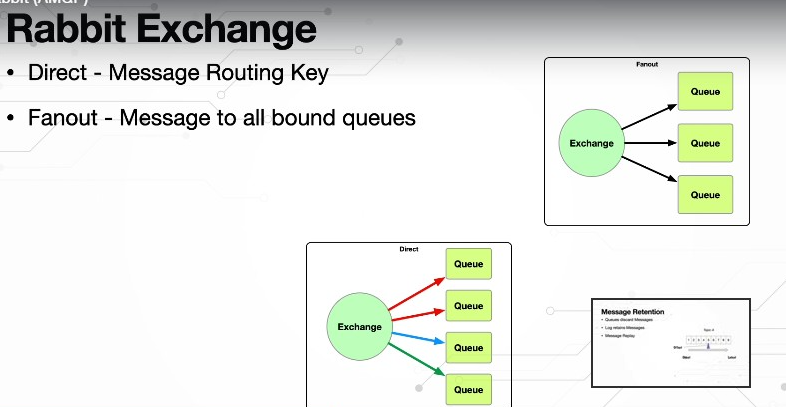
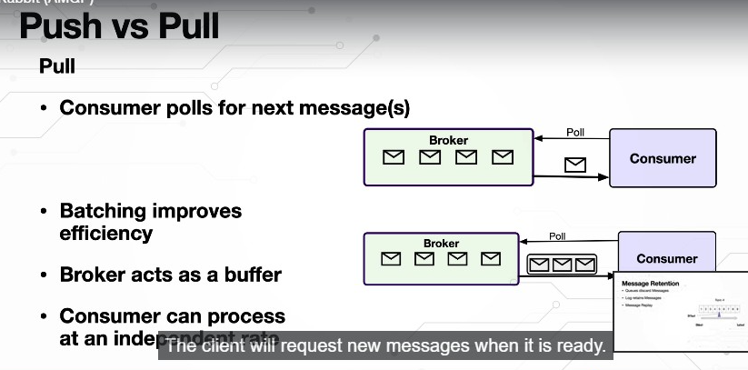

What is Kafka?

Kafka can have various definitions, depending on how we are using it, but one popular definition is

Kafka is a distributed commit log as events happen in a micro service application, these micro service

applications put these events onto a log apache

Kafka is a system for managing these logs.

The famous and popular term for these logs is a topic.

Kafka stores the events in a orderly fashion, and it also writes those to a disc not just one disc,

it can replicate them across disks to ensure that the messages or events are not lost.

Micro service applications exchange events through these topics or streams in real time.

And since the data and event can be processed as soon as they are produced, we can have Real-Time Analytics

and we can do recommendations or make decisions based on these analytics.

These Microservice applications will have their own processing logic, they dont

Just read the events from the topic and send them to another topic.

They will define their own computational logic.

That is where Kafka comes with the streaming API.The Microservice applications need to group data, aggregate

them, filter them, join them, etc..

Kafka gives us the streaming API, which is super simple to use and will be able to do all this right

out of the box in our Micro services is using the Kafka streaming API.

Last but not least, if there is data that is related to our applications in external databases or other

systems, we can use the Kafka connect, which can be easily configured.

We don't have to write any code.

There are hundreds of open source, uncommercial Kafka connecters that are readily available that can

integrate with other data sources or databases to fetch the data into Kafka, or to send the data from

Kafka to these external sources in a declarative manner with the simple configuration will be able to

use a connecter, connect to these data sources without writing any code.

In this lecture, you will learn why Kafka is so popular, that is the advantages of using Kafka.

The first Kafka supports multiple producers and consumers.

There is multiple producers can write to a single topic at the same time, and multiple consumers can

subscribe and consume messages from the very same topic.

Unlike traditional messaging systems, where once a message is consumed by a consumer from the topic,

it's gone.

But in Kafka, it retains the message, and another consumer application can still get the very same

message and process it in its own way.

Kafka also supports consumer groups and partitions that is within a application, a consumer application.

We can have parallel consumers running, which can be a part of a group called Consumer Group, and

the topic is divided into multiple partitions.

The messages from the producer will go across these partitions so that parallel processing is possible.

Kafka ensures that within a consumer group, the message will be consumed only once.

That is, only one consumer within the group will consume a particular message.

There will be no duplication.

So across applications, it allows the possibility of these applications processing the very same message.

But within a application, it allows parallelism by having a consumer group, and these consumers can

consume messages from various partitions which are nothing but divisions.

Within a topic.

You will learn partitions and consumer group in detail in lectures later on.

So this is where Kafka differs from traditional messaging systems and has all the advantages.

Secondly, it maintains a disk based persistence.

That is, even if a consumer is temporarily down because of a restart or a crash, when it comes back

up the kafka broker would have reatain the message in a disk storage with a preconfigurable amount of time

the consumer can get the message whenever it is ready.

Third, scalability as the Load on the kafka broker increases, these brokers can be easily scaled, for

our development environment, while learning Kafka we can use a just single broker.

But on our dev environment or testing environment, we can have 10 brokers.

And in a production environment, we can have a cluster of hundreds or thousands of brokers.

If one broker goes down, another broker will take over, giving us availability as well.

Last and most important performance because of all the aforementioned advantages, like multiple producers

and consumers having partitions and having parallel consumers consuming the messages and scalability,

we get a lot of performance gains by using Kafka.
The power and flexibility of Kafka allows us to use it to implement numerous use cases, starting with

messaging, Kafka can be used to exchange messages across micro service applications.

This could be one micro service application sending notifications to a Kafka topic to which other micro service

applications will subscribe and consume the notification to take the appropriate action.

Or we can also implement a simple producer consumer pattern where one micro service application is producing

a lot of work and other micro service applications.

Consume this work and get it done like order processing shipment, etc..

Activity tracking, this is how Kafka has originated at Linkedin, we can use it to track user activity

or any other activity, and we can feed it to a topic which can be read or are consumed by a machine

learning algorithm which can generate the recommendations for that user the producer application or the

website the user is browsing can read those recommendations and push them to the user whenever he does

a

Search Amazon, Netflix and various other websites does this as well.

Metrics and log aggregation as applications produce metrics on a regular basis or even logs, all those

can be aggregated and stored in a permanent storage for analysis.

This can be done right away as well.

Instead of waiting for a long time as the applications are producing metrics and logs, they can be

aggregated and put into systems like elastic search.

And we can right away analyze that data to see if there are any unwanted activities or security threats.

We can also use Kafka as a commit log, as database changes happen.

Those changes can be streamed on to a Kafka topic and we can use that data to replicate the database if

required, or simply to analyze what is going on with the database and see if there are any threats

or unwanted activity.

Last and very powerful stream processing, while all the aforementioned use cases can be treated as

streams, kafka streams open up doors for numerous use cases where we can create data pipelines as the

data flows through these pipelines and different stages.

Will have transformation, computational logic, the data will be transformed at each step and big data

tools like Hadoop, Storm, etc. can be a part of this data streaming pipelines as well.

So it is up to us how we want to use Kafka.

There are so many use cases, especially streaming opens up doors for using it to implement our own

custom use cases where we can have multiple streaming applications consuming from topics applying data

transformations which we create, and then putting them onto a another topic which will be fed to another

data streaming application and so on.

Where is or where can Kafka be used?

Kafka is the foundation for various big data platforms and even driven micro service applications,

cars, trucks and shipments can be tracked in real time using Kafka.

In factories kafka can be used to capture and analyze the Iot device data and make decisions on the fly.

Kafka can be used to process banking and stock exchange transactions in the financial world and in hospitals,

the patient information can be tracked and monitored and any changes in his condition can also be monitored

to treat him better.

In retail, hotel and travel, Kafka can be used to gather and react to customer interactions and based

on the customer interactions, recommendations can be shown to him.

Who use Kafka?

Maybe we should ask who doesn't use it because there are thousands of applications using Kafka around

the world, starting with Twitter, Twitter uses Kafka for its mobile app, Performance Management and

Analytics.

It has five billion sessions per day.

Uber uses Kafka to process more than a trillion events per day for thier log aggregation.

DB change log maintenance and several other events.

Streaming use cases they have even contributed a

UReplicator which is a cluster replication solution to the open source world.

Netflix uses a Kafka as their messaging backbone, with 4000 Kafka brokers in their cloud handling 700

billion events per day.

Yahoo uses Kafka for real time analytics, handling up to 20 GB data per second.

Pinterest users Kafka for its Real-Time advertising platform, with 2000 brokers handling eight billion

events per day.

These are only some of the popular applications.

Are clients using Kafka almost every application out there using Kafka in some way or the other.

In this lecture, you will learn about the four important components of Kafka architecture, namely

the Kafka, Broker, Zookeeper, producers and consumers.

The Kafka cluster is a collection of Kafka brokers, also referred to as Kafka Servers or Kafka Nodes

If you are coming from a messaging background, you already know what a broker is.

It is through the broker that the messages are exchanged between the producer and consumer applications.

The broker not only decouples the producer and consumer, but it also ensures that the messages are

persisted and are durable.

The Kafka Broker is a Java process, and we can increase the number of brokers to provide scalability

and durability of messages.

One of the brokers will be elected as a cluster leader or cluster controller.

All the other brokers will follow this leader.

It is the responsibility of the cluster leader or controller to manage the partitions.

Replicas and other administrative operations will be discussing this in detail in lectures later on.

Next is the zookeeper component, which is responsible for electing a cluster controller or leader,

all the broker nodes will register themselves with the zookeeper component when they come up and the

zookeeper will pick only one of the brokers as the cluster leader.

And if that broker goes down, it will pick up another broker as the cluster leader.

Zookeeper also maintains the state of the cluster like the metadata of the leader and followers.

The states, the quotas, the access control lists, everything will be maintained by zookeeper, although

Zookeeper is Apache opensource project of its own, when we install Kafka, it will come bundled with

Zookeeper, making it easy for us.

Kafka is also working on a component of its own that's going to replace Zookeeper in the near future.

Next is the producer component producer is an application that produces data that producers communicate

with the cluster using TCP protocol and they connect with the broadcast directly and start sending messages

to their topics.

A producer can send messages to multiple topics and a topic and receive messages from multiple producers

as well.

Last and the most important is the consumer.

It is an application that consumes from one or more topics, consumes records or data from one or more

topics and processes

it. Consumers coordinate among themselves as a group to balance the load and also track each other's

progress so they do a lot more work when compared to the producer applications.

We are going to discuss a lot more about it in lectures later on.

The producer applications create and exchange data using a record in Kafka.

There are seven attributes to a record, starting with topic partition, offset timestamp key headers

and finally the value.

The topic is the topic to which this record should be returned to the partition is a zero based index

to which the record should be written.

A record is always associated with only one partition, and the partition number can be set by the producer

application.

And if it is not set, it will be calculated based on the key that is provided in the record.

A hash value will be calculated by using the key value and the result will be used as the partition

number to which that record should go to.

Next is the offset, which is a 64 bit signed integer for locating the record within a partition.

The time stamp can be set by the producer application, and if it is not set, then the producer API

internally assigns the current time as the time stamp.

Next is the key, although it is called a key, it is an optional non-unique value, it is a array

of bytes.

A key value you present will be used to calculate the partition number.

A hash algorithm will be used along with this.

The value of the key and the partition number will be calculated to which the record should go to.

If the key value is not set because it is optional, then the Kafka will decide the partition number

in a Round-Robin fashion.

That is, it will assign the record to a particular partition based on the Round-Robin fashion.

And that might change in the future.

How Kafka wants to do it.

It is important to understand that although this attribute is called key, it is not the primary key

of our record.

We can even set the same key for multiple records on the producer, and all those records will end up

in the same partition.

So we can control that using the value of the key.

It is not unique.

If you want to uniquely identify a record, then you can use the partition number and the offset as

a composite primary key.

Using these two, you can uniquely identify a record.

Next is the headers, which is optional key value pairs, just like the Http headers to pass in metadata.

Last and very important is the value.

This is where the payload for our message lies.

It is a array of bytes.

It is the one that contains our business data, although the value is also optional.

Without it, the record doesn't make any sense.

So all the other attributes are like metadata for this data we are exchanging using the value attribute

as an assignment, I want you to launch your Web browser, search for Kafka, producer record Kafka,

producer record, go to the Kafka API page, Click on this, that will take you to the Kafka API.

And I want you to read this documentation of topic. It summarizes whatever I have just told you about the record.

You are going to use this producer record in lectures later on when you create a producer.

For now, just read this documentation up top and you will see that the constructor's.

That are used to create a producer record accept all these attributes which I have just talked about,

but the mandatory ones are the topic and the value.

The last constructor which takes the topic and value is the very minimum.

Otherwise, there are constructors that can take key value, partition, offset timestamp, etc..

In this lecture, we will learn about topics, partitions and offsets, messages in Kafka are returned

to a topic, and each topic can be divided into one or more partitions.

If Kafka is a distributed messaging or commit log, then a partition is a single log of messages or

Records. messages are appended to the end of a partition as they come in.

Kafka assigns each partition a unique number and also each message or a record that is stored within a

partition gets the offset value.

This offset values like array index.

It starts from zero for every partition.

And as the messages are stored, it will be incremented the partition number and the offset value uniquely

identify a record and also Kafka stores the partition number and offset value inside the record or

message.

Since messages can go across partitions, the messaging order across partitions is not guaranteed,

whereas the messaging order within a partition is maintained, the producer application can specify

which partition the message should go into using the partition number.

When a producer creates a record using the partition number attribute, it can tell which exact partition

it should go into.

Kafka will take that partition number and put the message into that partition.

If not, it can give you a key.

Kafka will use this key to calculate a hash and whatever the hash is that will become the partition

number into which that record will go into.

Even if the key is not provided by the producer, then Kafka will put the message into one of the partitions.

Using a Round-Robin algorithm.

Partitions give Kafka the power of scalability and availability.

That is, these partitions can be scaled across brokers' as the load increases, as there are too many

messages coming in.

Instead of putting all the partitions in one Broker, we can scale them across Brokers' here

I have four partitions on three brockers.

This will increase the performance and the application can be easily scaled.

Along with this

Partitions also support replication or duplication, which give high availability, as you can see

here, the partitions zero and one are present in Broker Zero as well as broker one.

The Partition two is present in broker one and also broker two.

And Partition three is duplicated both in broker two and broker zero.

This gives high availability.

Even if one broker goes down, another broker can take over.

That doesn't mean that all the brokers are processing the messages from each of these partitions.

It uses the concept of leader and follower here.

Each partition will have a leader and a follower.

In case of Broker zero, partition zero and one, have leader as broker zero.

In case of partition two the leader is broker one in case of partition three, the leader is broker two

for partition

three Broker zero is a Follower for partition, zero and one broker

One is a follower for partition two broker

Two is a follower.

Only if the other broker, which is the leader, goes down, these brokers will become the leader for

that partition as well.

It's like a backup.

We have a replica and if something goes wrong, the other broker can take over that work.

We can specify the

Duplication are the replicas we want using the replication factor, if the replication factor is one,

there will be no duplication.

The partition will be present on only one

Broker If the replication factor is two, then you will see something like what you see in these brokers.

The partitions will be duplicated, one copy will be created and they'll be stored across Brokers'.

The replication factory is three.

Then there will be two copies.

Total of three copies of a partition will exist across brokers'.

So when we create a topic we can specify the replication factor and also we can configure the replication

factor at a cluster level as well.

Partitions bring concurrency to Kafka, that is by having messages that belong to the topic spread across

partitions, we can create a consumer group.

A consumer group is a set of consumers working together to consume a topic.

A consumer group ensures that each partition is consumed by only one consumer.

Here we have four partitions and three consumers.

The first two consumers are consuming the first two partitions respectively, and the last consumer

is consuming the last two partitions.

Assigning a consumer to a partition is called the ownership of the partition by the consumer.

Consumers can easily be horizontally scaled.

That is, if the load on a consumer is increasing, we can scale up the consumers and the new consumer

will take over a partition.

Also, if one consumer feels the remaining consumers can coordinate among themselves and take over the

partitions that the failed consumer was working with.

This is a brief introduction to consumer group.

We will learn many more details in sections later on when you work with consumers.

In this lecture, I will introduce you to the concept of message batching Kafka producers won't send

one message at a time to the Kafka Broker instead they Batch them based on the topic and partition

to which they have to go to a batch, is a collection of messages that should be returned to that same

topic and partition.

This will reduce the network round trips, which otherwise are required to send each message to the kafka

brokers the larger the batch size, the more messages that will be processed in a given timeframe.

Batches are also typically compressed, providing more efficient data transfer and storage.

It will take some processing time.

Of course, it will take some processor to do this compression.

And also the messages are not sent as soon as they are produced.

So there will be some delay when we batch

So we have to make sure the batch size is not too big or too small.

We can configure the Batchsize in such a way to take advantage of message batching.

*A Kafka cluster is a combination of Brokers
*If a partion is not specified in the record which field in the record will be used to calculate a hash value Ans Key
*The division of a Kafka Topic is called a Partion
*The number of replicas of partitions can be controller using Replication Factor
*A consumer group ensures that a partition is consumed by only one consumer True
*Kafka producers batch messages based on Topic and partition

###Kafka Command CLI
kafka-topics --list --bootstrap-server localhost:9092

kafka-topics --create --bootstrap-server localhost:9092 --replication-factor 1 --partitions 1 --topic first-topic

kafka-topics --describe --bootstrap-server localhost:9092 --topic first-topic

kafka-console-consumer --bootstrap-server localhost:9092 --topic first-topic

kafka-console-producer --broker-list localhost:9092 --topic first-topic

kafka-topics --delete --bootstrap-server localhost:9092 --topic first-topic

Note:

For delete add the following in kafka server.properties

delete.topic.enable=true

To Start the kafka in windows the bin/windows in environment 
Step 1 :- open cmd and start the zookeeper using zookeeper-server start <configfolder path>\zookeeper.properties
Step 2 :- open cmd and start the kaka using kafka-server start <configfolder path>\server.properties

In addition to the command line tools for managing and administering the Kafka cluster, Kafka gives

Five core APIs application programming interfaces officially in Java and Scala.

But other programming languages like Python are building their own support for these APIs as well.

The first of these is the admin API, which allows us to manage and inspect the topics brokers and other

objects in the Kafka cluster.

GUI based tools are Web applications like Kafka drop make use of this admin API and they give us a browser

based access to the Kafka cluster.

Once we have Kafka drop running, we'll be able to manage our topics, brokers, etc, from our Web

browser through the Kafka drop and Kafka Drop internally uses the admin API to do its job.

Next is the producer and consumer API, which we use in our applications, the producer API is to publish

a stream of event records or messages to one or more Kafka topics.

The Consumer API is to subscribe and read those stream of messages from the Kafka broker.

Unlike traditional messaging systems, the producer and consumer APIs in kafka does a lot more.

On the producer side.

They automatically take it off serialisation, partition assignment and more, and on the consumer side,

they take care of deserialisation rebalancing and much more.

The streaming API allows us to implement stream processing applications, it allows to process event

streams and apply transformations, maintain state and much more.

We read from one topic, apply some transformations and write to another topic, a continuous stream

of data flow.

Last but not the least, the kafka connect API is to build and run reusable data, import and export connectors.

They allow us to import and export data from other systems so that they can integrate with Kafka.

Kafka provides a handful of ready to use connectors that can connect to various data sources.

It can be MySQL, Postgres, ElasticSearch, Kafka community provides us with ready to use characters

that can integrate with these data sources, fetch data to Kafka or push data from Kafka into these

data sources.

This lecture, I will walk you through the Kafka producer workflow in traditional messaging systems,

the producer API sends a message to the broker, gets a response back, and it is done.

But a Kafka producer does a lot more behind the scenes to start sending messages.

We create a producer record on which we can set various attributes, mainly the topic and the value,

which is the payload.

Optionally, we can set the partition timestamp key and headers once we have a producer record, will invoke

the send method on the producer.

At this point, the producer will hand over the producer record to serializer.

The serializer will look for the key and value in the record and it will convert them from our Java types

into byte arrays.

Kafka has several inbuilt serializes that can work with common types in Java.

you will also learn how to write our own custom serializers to convert object types into byte arrays and

later on you will use Avro, which does it for us out of the box as well.

Once the serializer converts the key and value into Bite array the record will be handed over to the

partitioner

The partitioner checks if the record has a partition number.

If the partition number is that it will use that as the partition that the record should go into.

If not, it will use the value of the key and a hashing algorithm to calculate the partition number.

Even if the key is not present, then a partition number will be assigned in a Round-Robin fashion.

At this point, the producer knows the which partition the record should go to.

It will add the records to the batch that should go to a particular topic and partition.

And a separate thread will pick up these batches and send them to that Kafka broker and the broker receives

the message and successfully writes it to Kafka.

We get a record metadata back if the right was successful and if the broker fails for some reason,

we get that failure back.

At this point, the producer can retry multiple times to send the message again to that topic and

partition.

If it keeps failing after some time, it will give up and throw the exception.

So all this happens within the producer, the serialization of the key and value, then the partitioner

taking care of which partition the record should go into putting those into batches.

And then a separate thread within the producer API will pick up that batch and send it to the Kafka

broker , which simply takes the message, writes it to the appropriate partition within a topic.

It was a fire and forget because we didn't wait for the response to come back, the send method returns

back a future record, metadata, hit control one assign statement to a new local variable.

And it returns you a future on which you can wait for the response.

And it is of time record metadata whenever the response is ready.

Once the message is placed on the topic, you get the metadata of that record do a control Z

Invoke dot get on the future hit control one, assign statement by a local variable will get a record

metadata.

Now, this is a synchronous call.

It is not a fire.

And forget, we are waiting for the record metadata.

Whenever it is ready do a sysout record metadata, dot partition, will tell us the partition where the message

went to similarly

Sysout record metadata, dot offset, will give us the offset as well.

Right click run java application and you will see those two values being printed on the console.

Now we have just one message being sent, but if there are thousands or millions of messages.

There will be some delay when we get that record metadata back.

So this is a synchronous call.

We are waiting for the response.
In this lecture, I will walk you through the Kafka Consumer API to create a consumer will create an

instance of the Kafka consumer class pass it the properties, just like the producer, we have the bootstrap

servers, which is a list of Kafka brokers, the key deserializer.

In this case, we have a de serializer in the producers.

We have a serializer here.

We have a deserializer.

It is a class from the Kafka library which implements that deserializer interface from Kafka.

We have string de serializer , integer deserializer and so on, and we can create our own deserializers

by implementing the deserializers interface from Kafka.

Next is the value deserializer property.

And finally, the consumer needs one more additional property, which the producer doesn't have, which

is the group Id.

Every consumer can belong to a particular group and it will consume the same set of messages.

Once we have a consumer created, it needs to subscribe to a topic to do that, we invoke the subscribe

method, which can take either a collection of topics or we can even use regular expressions to match

multiple topics.

The consumer can subscribe to multiple topics.

One, subscribe to invoke the poll method.

This is when the consumer will start polling the topic for messages and we provide a timeout once it

polls, it will wait for whatever timeout we have given.

And if there are no records, it will return empty records.

If there are records within that given time, it will return a collection of all those records which

we can loop through, get the key and value.

This poll method does a lot of things behind the scenes.

It simplifies a lot of things for us.

It does the partition rebalancing.

It checks the heartbeat's, it does the data fetching and a lot more.

In this lecture, we will create a Kafka consumer to do that, go to the consumer projects, source main

Java package, right.

click create a new class, call it, order consumer with the main method, finish double click to maximize

hit control D to delete that.

The first few lines will be similar to the other producers, so you can grab the properties from the

order producer, come back, paste them.

The first one is boot straps, servers, which remains the same, the second is the key dot de serializer

in case of consumer it will be de serializer unvalue or dot de serializer is the property name.

And the value for this property will also change.

It is not string serializer here.

It will be string de serializer .

Des

Same for integer Deserializer.

This will be Deserializer.

Make sure you get the casing right.

D is capital, everything else is small.

Copy that property.

We have one additional property we need to provide on the consumer, that is the consumers group ID ,

get rid of that key group, DOT ID

This can be any value that we want to provide, we'll call it, order group order group is the group.

This consumer belongs to create a new Kafka consumer by passing in the properties, props hit control

one, assign that to a local variable call this consumer.

And the key type is string value type is integer.

Once we have a consumer, we need to subscribe consumer dot, subscribe, consumer dot, subscribe is the method

you can pass this a pattern like a regular expression pattern where you can subscribe to multiple topics

using a wild card pattern, or you can pass in a collection of strings, which are the topic names.

I'm going to pass it to collection of strings collections.

Dot Singleton list will give me a list.

I pass in that order topic is what we have.

Once the subscription is done, the consumer needs to poll to the topic, the poll method can take milliseconds.

This is deprecated, so we no longer use this long milliseconds.

We use this method which takes the duration object, duration dot if you say zero.

The consumer will poll to see if the topic how any messages, if it doesn't, it will immediately return

back, it will not wait.

Instead of that, if you pass in milliseconds, there is method that takes milliseconds of Millies .

You can pass in a thousand milliseconds like that.

Or if you if you want to use seconds, it is of seconds.

I want to wait 20 seconds.

Will change this in the next lecture for now.

Will Poll, if there are no messages, we'll wait for 20 seconds within that 20 seconds.

If there are messages then this Poll method will return us.

Records assign this to a local variable to see what it returns.

Call it records or we can call this orders because we know that the records are nothing but orders.

So this returns back to consumer records object.

It is a collection.

use a for each loop.

And loop through these consumer records or orders to get the consumer record, each time we loop,

we get a consumer record object.

This is of type string and integer hit control.

Well, on this import, the consumer record.

And within this loop, we get that data sys out first is the product name the key that is being passed

in plus here instead of consumer record, you can call this order order.

Dot Key will give us the product name.

You can copy that line.

Paste it order dot value will give us the quantity.

Of that product being ordered.

And at the end of it, you can close the consumer right here after the far loop , consumer dot close,

will close the connection.

Right, click run the program as java application.

If all is well, it should have started, there we go, you can see it running, there is a stop button

here.

It will poll for 20 seconds.

It will poll and wait for 20 seconds to go run the producer now.

Order producer run that guy.

And you see that happening on the producer side, on the consumer side order consumer side.

You see that data being received as a product name is MacBook Pro and quantities 10.

If it is still polling, you can run the producer one more time.

The producer has run successfully, if the 20 seconds have not elapsed, then we will see it.

If not, the consumer is down so you can run it again.

But the key here is you have learned how to write a consumer by creating the properties, then the Kafka consumer

object.

You let it know which topic the consumer should subscribe to using the subscribe method.

Then you poll that topic by passing time duration.

If you pass it zero, the poll method will immediately return if there are no records there .

And then once we get these customer records, we loop through it, get each record out and get our data

out of it.

Kafka producer does not creates the partitions
Which of the following is not a part of a Kafka Producer API
Put the record in a partion and return metadata
The Kafka Broker expects the key and value in the record to be of Byte array type
A synchronous send method call returns Future<RecordMetadata>

The serialize method in a Serializer class returns byte [] array
We cannot use the inbuilt ready to use Kafka api classes to serialize and deserialize object types

##Apache AVRO
In the previous section, you have learned how to create custom serializer and deserializers to serialize

and deserialize object type data in Kafka, in this section, you are going to learn about Apache Avro,

which is a supercool framework that can do it right out of the box.

Once we start using Avro, we don't have to create this custom serializers and deserializers

Apache Avro is the open source project from Apache, which gives us a language neutral syntax.

So we are going to create schema file that represents our language object, whether it is order consumer

logs, etc. and on the producer side will use the Kafka Avro serializer from Avro right out of the box.

This serializer knows how to serialize the objects.

The language objects into a byte objects by looking at this schema file.

Once the object is converted into Byte array, we hand it over to the Kafka broker .

Similarly, on the consumer side, we have the Kafka Avro deserializer that can look at the schema file,

which we create, and then it will convert the byte, array back in to a language object.

How do the producer and consumer exchange this schema file we do it through a schema registry?

So on the producer side we configure a schema registry URL , which will be learning in the next few

lectures, and the Kafka Avro serializers are intelligent enough to automatically push the schema

to this schema registry and the Kafka Avro.

deserializers will look at the consumer configuration where we give the schema registry URL pull that

schema and do the deserialization for us.

This schema file is usually a Json file.

This can be a Json string object or an array typically it'll be a Json object where we can define

the record, the namespace and various fields and the field types, just like our Java types, can be

null if it doesn't carry any data int for integer long float double.

We have bytes and finally the string type, which is character sequences.

So the schema will typically look like this.

Here is a sample schema, which you will be creating in the next lecture.

It's a simple Jason file namespace is the first part which uniquely identifies the schema, which uniquely

gives it a namespace, its like package.

In Java, the type is record by default.

The name you use is the name of this record.

The fields are just like the fields we define in the class.

We give it a name and then that type, the customer name is of type string, product of type string.

Quantity is int the beauty of Avro.

We can generate a Java class out of this schema.

If you have worked with Java Web services, where you create wisdol file and then generate the stubs out

of it.

We are going to do something like that.

In the next few lectures.

We create the schema file and then we can create or generate a Java object using the Avro Maven plugin

and we can serialize and deserialize that object using out-of-the-box Kafka Avro serializers and Kafka Avro

deserializers.

As we use Avro, each record that is produced will comply to our Avro schema, these schemas will evolve

and change over time.

As for the business needs and when that happens, the downstream consumer applications and the deserializers

need to know about the latest schema files.

That is where the schema registry servers come in as different consumers might need different versions

of these schemas.

The schema registry server should maintain their different versions of a particular schema as well.

Confluent provides an open source implementation of the schema registry, which we are going to use.

In this lecture, I will walk you through the magic that happens behind the scenes once you start using

this Schema registry and the Avro Serializers and deserializers .

Once you start using the Schema registry you will create producers where you will use Keema file Avro schema

file that will be creating and they will use Avro serializer class, that is where the magic begins.

The Avro serializer not only converts the data into bytes, it also ensures that the data is compliant

with the schema file you have created.

It doesn't stop there.

It will take this schema file for the very first time.

We are using it and it pushes it to the schema registry.

Using the information we provide.

We configure the schema registry URL in the producers, the Avro serializer users.

That information connects to the schema registry pushes the schema to the schema registry.

The schema registry will store this schema file.

It will version it and they use the term called subject.

A subject is just a scope within which schema evolves over time.

It doesn't stop there, the Avro serializer will take the unique ID that is assigned to this schema by the

schema registry and it will store it in the header section of the record that is going out.

It then puts the data as well into the record and then the data will be sent by the producer or the

record will be sent by the producer to the Kafka.

Brokers that is the magic on the producer side.

Then we move on to the consumer side where we use the Avro.

Deserializers this guy will look at the schema ID in the header section of the record.

It connects to the schema registry using the schema registry URL we provide on the consumer fetches

The schema validates the data that came in against this schema.

All that magic happens behind the scenes, thanks, the Avro serializers and deserializers ,

And as these schemas change over time, the new schemas, when they are pushed, the versions will be

maintained magically by the schema registry.

So always the latest schema version, the id of it will be included in the record that will be sent

to the consumers.

The deserializers will come in, validate the data as per the ID that came in.

I'll talk a little more about the schema, compatibility, etc. after the hands on lecture's.

With this knowledge, you can work on the Avro hands on section and then we'll come back, revisit the

compatibility and the schema versioning a little bit later on.

And in between you and me, a secret is that this schema registry stores, all these schemas behind

the scenes in Kafka.

It uses underscore schemas topic and it stores them internally that we don't touch the topic.

But just for your information.

Kafka is used by this schema registry to store the schemas.